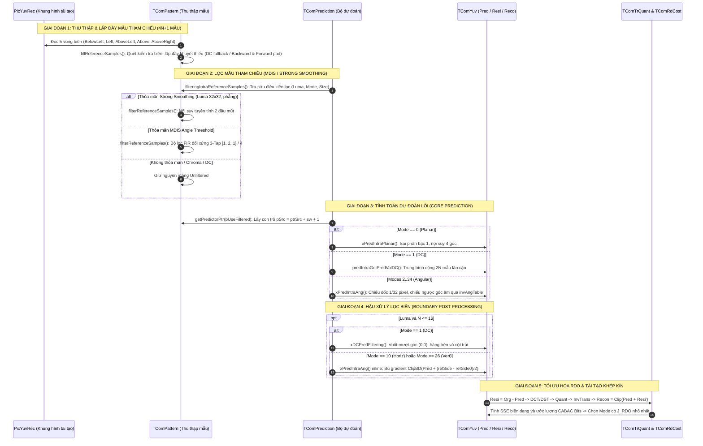

# TÀI LIỆU KỸ THUẬT TOÀN DIỆN VỀ INTRA PREDICTION TRONG HEVC (HM REFERENCE SOFTWARE)

Tài liệu này cung cấp bản đặc tả kỹ thuật, toán học và đóng gói toàn bộ mã nguồn C++ của mô hình tham chiếu **HM (HEVC Test Model - phiên bản HM-16.0)** thuộc chuẩn nén video quốc tế **ITU-T H.265 | ISO/IEC 23008-2 HEVC**.

Tài liệu được cấu trúc theo đúng phương pháp luận kỹ thuật: **Tổng hợp hệ thống dưới dạng bảng và sơ đồ luồng thực thi trước**, sau đó **đi chi tiết vào từng hàm C++ (mã nguồn, bảng biến, kiểu dữ liệu, kích thước, input/output, công thức tính toán và liên kết luồng dữ liệu)**.

---

## MỤC LỤC TỔNG THỂ

* [PHẦN I: TỔNG HỢP HỆ THỐNG, BẢNG TỔNG HỢP & SƠ ĐỒ LUỒNG THỰC THI](#phần-i-tổng-hợp-hệ-thống-bảng-tổng-hợp--sơ-đồ-luồng-thực-thi)
  * [1. Sơ đồ Luồng Thực Thi Phân Cấp (Hierarchical Execution Flowchart)](#1-sơ-đồ-luồng-thực-thi-phân-cấp)
  * [2. Bảng Tổng Hợp Master Các Hàm Intra Prediction trong HM](#2-bảng-tổng-hợp-master-các-hàm-intra-prediction-trong-hm)
  * [3. Bảng Danh Mục Vùng Đệm Bộ Nhớ & Biến Toàn Cục (Global Buffers & Data Dictionary)](#3-bảng-danh-mục-vùng-đệm-bộ-nhớ--biến-toàn-cục)
  * [4. Sơ Đồ Chuyển Dịch Trạng Thái & Hình Học Điểm Ảnh 2D/1D](#4-sơ-đồ-chuyển-dịch-trạng-thái--hình-học-điểm-ảnh-2d1d)
* [PHẦN II: CHI TIẾT TỪNG HÀM C++: MÃ NGUỒN, BẢNG BIẾN, TOÁN HỌC & CƠ CHẾ TÍNH TOÁN](#phần-ii-chi-tiết-từng-hàm-c-mã-nguồn-bảng-biến-toán-học--cơ-chế-tính-toán)
  * [GIAI ĐOẠN 0: KHỞI TẠO VÙNG MẪU BIÊN (ROI INITIALIZATION)](#giai-đoạn-0-khởi-tạo-vùng-mẫu-biên-roi-initialization)
    * [Hàm 1: `TComPattern::initPattern`](#hàm-1-tcompatterninitpattern)
  * [GIAI ĐOẠN 1: THU THẬP & LẤP ĐẦY MẪU THAM CHIẾU (SUBSTITUTION)](#giai-đoạn-1-thu-thập--lấp-đầy-mẫu-tham-chiếu-substitution)
    * [Hàm 2: Các hàm kiểm tra tính khả dụng lân cận (`isAboveLeftAvailable`, `isAboveAvailable`, v.v.)](#hàm-2-các-hàm-kiểm-tra-tính-khả-dụng-lân-cận)
    * [Hàm 3: `fillReferenceSamples`](#hàm-3-fillreferencesamples)
  * [GIAI ĐOẠN 2: LỌC MẪU THAM CHIẾU (MDIS & STRONG INTRA SMOOTHING)](#giai-đoạn-2-lọc-mẫu-tham-chiếu-mdis--strong-intra-smoothing)
    * [Hàm 4: `TComPrediction::initIntraPatternChType`](#hàm-4-tcompredictioninitintrapatternchtype)
    * [Hàm 5: `TComPrediction::filteringIntraReferenceSamples`](#hàm-5-tcompredictionfilteringintrareferencesamples)
    * [Hàm 6: `filterReferenceSamples` (Nội tuyến: SIS 32x32 & MDIS 3-Tap)](#hàm-6-filterreferencesamples)
    * [Hàm 7: `TComPrediction::getPredictorPtr`](#hàm-7-tcompredictiongetpredictorptr)
  * [GIAI ĐOẠN 3 & 4: TÍNH TOÁN DỰ ĐOÁN LÕI & LỌC BIÊN (CORE PREDICTION & BOUNDARY FILTERING)](#giai-đoạn-3--4-tính-toán-dự-đoán-lõi--lọc-biên)
    * [Hàm 8: `TComPrediction::predIntraAng`](#hàm-8-tcompredictionpredintraang)
    * [Hàm 9: `TComPrediction::xPredIntraPlanar` (Chế độ Planar - Mode 0)](#hàm-9-tcompredictionxpredintraplanar)
    * [Hàm 10: `TComPrediction::predIntraGetPredValDC` (Chế độ DC - Mode 1)](#hàm-10-tcompredictionpredintragetpredvaldc)
    * [Hàm 11: `TComPrediction::xDCPredFiltering` (Hậu xử lý lọc biên DC)](#hàm-11-tcompredictionxdcpredfiltering)
    * [Hàm 12: `TComPrediction::xPredIntraAng` (Dự đoán góc 33 Modes 2..34)](#hàm-12-tcompredictionxpredintraang)
  * [GIAI ĐOẠN 5: TỐI ƯU HÓA RDO & ĐIỀU PHỐI MÃ HÓA (RDO SEARCH & ENCODER CONTROL)](#giai-đoạn-5-tối-ưu-hóa-rdo--điều-phối-mã-hóa)
    * [Hàm 13: `TComDataCU::getIntraDirPredictor` (Sinh 3 chế độ MPM)](#hàm-13-tcomdatacuintradirpredictor)
    * [Hàm 14: `TComDataCU::getAllowedChromaDir` (5 chế độ Intra Chroma)](#hàm-14-tcomdatacuallowedchromadir)
    * [Hàm 15: `TEncSearch::xModeBitsIntra` (Ước lượng bit cú pháp CABAC)](#hàm-15-tencsearchxmodebitsintra)
    * [Hàm 16: `TEncSearch::estIntraPredLumaQT` (Tìm kiếm Luma 2 vòng: SATD -> RDO)](#hàm-16-tencsearchestintrapredlumaqt)
    * [Hàm 17: `TEncSearch::xIntraCodingTUBlock` (Chu trình nén TU: DCT, Quant, Recon, Distortion)](#hàm-17-tencsearchxintracodingtublock)
    * [Hàm 18: `TEncCu::xCheckRDCostIntra` (Đánh giá RDO cấp CU 2Nx2N và NxN)](#hàm-18-tenccuxcheckrdcostintra)
* [PHẦN III: MINH HỌA SỐ HỌC TỪNG BƯỚC & CASE STUDY THỰC TẾ](#phần-iii-minh-họa-số-học-từng-bước--case-study-thực-tế)
  * [1. Ví Dụ Tính Toán Số Học Khối 4x4 (End-to-End Walkthrough)](#1-ví-dụ-tính-toán-số-học-khối-4x4)
  * [2. Case Study Thực Tế: Khối 8x8 Trên Ảnh Pasted_image.png](#2-case-study-thực-tế-khối-8x8-trên-ảnh-pasted_imagepng)

---

# PHẦN I: TỔNG HỢP HỆ THỐNG, BẢNG TỔNG HỢP & SƠ ĐỒ LUỒNG THỰC THI

## 1. Sơ đồ Luồng Thực Thi Phân Cấp

Toàn bộ quá trình Intra Prediction trong phần mềm tham chiếu HM được tổ chức theo cấu trúc phân tầng chặt chẽ từ mức Frame (Picture) $\to$ CTU ($64 \times 64$) $\to$ CU ($64 \dots 8$) $\to$ PU ($2N \times 2N, N \times N$) $\to$ TU ($32 \dots 4$).

### 1.1. Cây Gọi Hàm Điều Phối Từ Encoder Đến Lõi Pixel (Call Tree)

```text
TEncSlice::compressSlice()
 └── TEncCu::compressCtu()
      └── TEncCu::xCompressCU() [Duyệt đệ quy QuadTree phân tách CU]
           └── TEncCu::xCheckRDCostIntra() [Đánh giá Cost RDO cho khối Intra]
                │
                ├── TEncSearch::estIntraPredLumaQT() [TỐI ƯU HÓA INTRA LUMA]
                │    │
                │    ├── TComPrediction::initIntraPatternChType() [GIAI ĐOẠN 1 & 2]
                │    │    ├── isAboveLeftAvailable(), isAboveAvailable(), ... [Kiểm tra biên khả dụng]
                │    │    ├── fillReferenceSamples() [GIAI ĐOẠN 1: Lấp đầy 4N+1 mẫu biên khuyết]
                │    │    └── filterReferenceSamples() [GIAI ĐOẠN 2: Lọc MDIS 3-Tap hoặc Strong Smoothing]
                │    │
                │    ├── [VÒNG 1 - FAST ROUGH SEARCH: 35 CHẾ ĐỘ LUMA]
                │    │    ├── TComPrediction::predIntraAng() -> xPredIntraAng() / xPredIntraPlanar()
                │    │    ├── TComRdCost::calcHad() [Tính SATD bằng phép biến đổi Hadamard 4x4/8x8]
                │    │    ├── TEncSearch::xModeBitsIntra() [Ước tính bit cú pháp bằng CABAC]
                │    │    └── TEncSearch::xUpdateCandList() [Lọc danh sách Top K ứng viên có Cost SATD nhỏ nhất]
                │    │
                │    ├── TComDataCU::getIntraDirPredictor() [Tính 3 chế độ MPM chèn thêm vào danh sách]
                │    │
                │    └── [VÒNG 2 - FULL RATE-DISTORTION SEARCH TRÊN DANH SÁCH RÚT GỌN]
                │         └── TEncSearch::xRecurIntraCodingLumaQT()
                │              └── TEncSearch::xIntraCodingTUBlock()
                │                   ├── TComPrediction::predIntraAng() [Tạo ma trận dự đoán hoàn chỉnh]
                │                   │    ├── xPredIntraPlanar() [Mode 0 - Bilinear 4 góc]
                │                   │    ├── predIntraGetPredValDC() + xDCPredFiltering() [Mode 1]
                │                   │    └── xPredIntraAng() [Modes 2..34: Chiếu 1/32-pel + Lọc biên Gradient]
                │                   ├── Tính sai số dư: Resi = Org - Pred
                │                   ├── TComTrQuant::transformNxN() [Forward Core DCT-II / DST-VII]
                │                   ├── TComTrQuant::quant() [Lượng tử hóa hệ số tần số RDOQ]
                │                   ├── TComTrQuant::invTransformNxN() [Lượng tử ngược & Biến đổi ngược]
                │                   ├── Tái tạo điểm ảnh: Recon = ClipBD(Pred + Resi')
                │                   ├── Đo biến dạng thực tế: SSE = sum((Org - Recon)^2)
                │                   └── CABAC Entropy Encoding -> J_RDO = SSE + lambda * Bits
                │
                ├── pcRecoYuvTemp->copyToPicComponent() [Ghi tạm Luma tái tạo vào PicYuvRec làm mẫu biên]
                │
                └── TEncSearch::estIntraPredChromaQT() [TỐI ƯU HÓA INTRA CHROMA]
                     ├── TComDataCU::getAllowedChromaDir() [Xác định 5 modes: Planar, Vert, Hor, DC, DM]
                     └── xRecurIntraChromaCodingQT() -> xIntraCodingTUBlock() [Full RDO cho kênh Cb và Cr]
```

### 1.2. Sơ Đồ Tuần Tự 5 Giai Đoạn Tại Mức TU (Sequence Diagram)



---

## 2. Bảng Tổng Hợp Master Các Hàm Intra Prediction trong HM

Bảng dưới đây tổng hợp tường minh toàn bộ 18 thành phần hàm thực thi Intra Prediction trong HM, phân định chi tiết vai trò, vị trí tệp nguồn, các biến đầu vào, đầu ra, kích thước bộ nhớ, kiểu dữ liệu C++, thuật toán và mối liên kết luồng dữ liệu:

| STT | Tên Lớp & Hàm C++ | Tệp Nguồn & Dòng | Vai Trò & Tầng Thực Thi | Đầu Vào (Input: Tên, Kiểu, Kích Thước, Nguồn) | Đầu Ra (Output: Tên, Kiểu, Kích Thước, Đích) | Thuật Toán Lõi & Công Thức Toán Học | Mối Liên Kết Dữ Liệu Trong Pipeline |
| :---: | :--- | :--- | :--- | :--- | :--- | :--- | :--- |
| **1** | `TComPattern::`<br>`initPattern` | `TComPattern.cpp`<br>`Dòng 89-105` | Khởi tạo thông tin ROI và con trỏ gốc cho khối đang xét | • `Pel* piY`: Con trỏ ảnh gốc/tái tạo<br>• `Int roiWidth, roiHeight`: $4..64$<br>• `Int stride`: Stride khung hình<br>• `Int bitDepthLuma`: 8 hoặc 10 bit | • `m_piROIOrigin = piY`<br>• `m_roiWidth, m_roiHeight`<br>• `m_patternStride, m_bitDepth` | Lưu trữ con trỏ và kích thước hình học vào biến thành viên đối tượng `TComPattern`. | Cung cấp tọa độ và stride khung hình cho các hàm truy vấn lân cận tiếp theo. |
| **2** | `::isAboveLeftAvailable`<br>`::isAboveAvailable`<br>`::isLeftAvailable`<br>`::isAboveRightAvailable`<br>`::isBelowLeftAvailable` | `TComPattern.cpp`<br>`Dòng 580-750` | Kiểm tra tính hợp lệ của 5 vùng lân cận quanh khối | • `const TComDataCU* pcCU`: CU hiện tại<br>• `UInt uiPartIdxLT, RT, LB`: Chỉ số Z-scan góc<br>• `Bool* bValidFlags`: Mảng cờ lân cận | • Trả về `Bool` hoặc `Int` số lượng phân vùng hợp lệ.<br>• Mảng `bValidFlags` được điền cờ `true/false`. | Kiểm tra: Biên bức tranh, Biên lát cắt (Slice), Biên Tile, Cờ `ConstrainedIntra` (nếu bật, cấm lấy mẫu từ khối Inter). | Quyết định từng khối con trong số $4N+1$ mẫu có thể đọc trực tiếp từ `PicYuvRec` hay không. |
| **3** | `::fillReferenceSamples` | `TComPattern.cpp`<br>`Dòng 326-543` | Thu thập và lấp đầy các mẫu biên khuyết thiếu (Substitution) | • `Int bitDepth`: Độ sâu bit<br>• `const Pel* piRoiOrigin`: Gốc khối trên `PicYuvRec`<br>• `const Bool* bNeighborFlags`: Mảng cờ $4N_{\text{unit}}+1$<br>• `Int iNumIntraNeighbor`: Số khối hợp lệ<br>• `UInt uiWidth, uiHeight`: $2N+1$<br>• `Int iPicStride`: Stride ảnh | • `Pel* piIntraTemp`: Mảng 1D đệm tham chiếu.<br>Kích thước: $(2N+1) \times (2N+1)$ phần tử.<br>Stride: $sw = 2N+1$. | **TH1 (0 mẫu khả dụng):** Điền DC $= 1 \ll (\text{bitDepth}-1)$.<br>**TH2 (100% khả dụng):** Sao chép trực tiếp từ `PicYuvRec`.<br>**TH3 (Khả dụng 1 phần):** Quét ngược Backward Pad từ Below-Left, sau đó quét xuôi Forward Pad. | Biến đổi tập hợp pixel biên rải rác trên khung hình thành mảng 1D liên tục $4N+1$ mẫu không còn ô khuyết. |
| **4** | `TComPrediction::`<br>`initIntraPatternChType` | `TComPattern.cpp`<br>`Dòng 119-270` | Nhạc trưởng điều phối chuẩn bị mẫu biên cho 1 kênh màu | • `TComTU &rTu`: Đơn vị biến đổi TU<br>• `ComponentID compID`: Y, Cb, Cr<br>• `Bool bFilterRefSamples`: Cờ cho phép lọc | • Ghi dữ liệu vào mảng đệm `m_piYuvExt[compID][UNFILTERED]` và `[FILTERED]` (kích thước $(2N+1)^2$). | Gọi kiểm tra khả dụng $\to$ gọi `fillReferenceSamples` $\to$ kiểm tra điều kiện lọc $\to$ gọi lọc MDIS / SIS. | Chuẩn bị đầy đủ cả 2 mảng tham chiếu thô và mảng đã lọc sẵn sàng trong `m_piYuvExt`. |
| **5** | `TComPrediction::`<br>`filteringIntraReferenceSamples` | `TComPattern.cpp`<br>`Dòng 545-578` | Tra cứu quyết định có áp dụng lọc MDIS hay không | • `ComponentID compID`: Y, Cb, Cr<br>• `UInt uiDirMode`: Chế độ dự đoán $0..34$<br>• `UInt uiTuChWidth, Height`: Kích thước $N$<br>• `ChromaFormat chFmt`: 4:2:0, 4:2:2<br>• `Bool intraReferenceSmoothingDisabled` | • Trả về `Bool`: `true` nếu cần lọc, `false` nếu không lọc. | • `!isLuma(compID) -> false` (Chroma không lọc).<br>• `uiDirMode == DC -> false` (DC không lọc).<br>• $\text{diff} = \min(\|\text{mode}-10\|, \|\text{mode}-26\|)$.<br>• Lọc khi $\text{diff} > \text{aucIntraFilter}[\text{depth}]$. | Chỉ định Giai đoạn 3 lấy mẫu từ `PRED_BUF_FILTERED` hay `PRED_BUF_UNFILTERED`. |
| **6** | `filterReferenceSamples`<br>*(nội tuyến trong `initIntra`)* | `TComPattern.cpp`<br>`Dòng 200-324` | Lọc mượt mẫu tham chiếu (MDIS 3-Tap hoặc Strong Smoothing) | • `const Pel* piIntraTemp`: Mảng mẫu thô<br>• `Int stride`: $sw = 2N+1$<br>• `UInt uiTuWidth, Height`: Kích thước $N$<br>• `Bool useStrongIntraSmoothing` | • `Pel* piDestPtr`: Mảng đích `PRED_BUF_FILTERED` (kích thước $4N+1$ mẫu biên). | **Strong Smoothing (Luma 32x32):**<br>$\|p_{-1,-1}+p_{-1,63}-2p_{-1,31}\| < \beta$<br>$\|p_{-1,-1}+p_{63,-1}-2p_{31,-1}\| < \beta$<br>Nội suy song tuyến nối 2 đầu mút.<br>**MDIS 3-Tap $[1, 2, 1]/4$:**<br>$p'_i = (p_{i-1} + 2p_i + p_{i+1} + 2) \gg 2$. | Triệt tiêu các gai nhọn tần số cao trên mẫu biên, giảm thiểu vân sọc giả khi ngoại suy khối lớn. |
| **7** | `TComPrediction::`<br>`getPredictorPtr` | `TComPrediction.h`<br>`Dòng 104-107` | Lấy con trỏ đến mảng tham chiếu tương ứng | • `ComponentID compID`: Y, Cb, Cr<br>• `Bool bUseFiltered`: Chọn thô hay lọc | • Trả về `Pel*`: Con trỏ trỏ tới đầu mảng `m_piYuvExt[compID][idx]`. | `return m_piYuvExt[compID][bUseFiltered ? 1 : 0];` | Cung cấp địa chỉ vùng nhớ mẫu biên chính xác cho các hàm toán học dự đoán. |
| **8** | `TComPrediction::`<br>`predIntraAng` | `TComPrediction.cpp`<br>`Dòng 394-473` | Điều phối tổng thể quá trình tạo ma trận dự đoán $N \times N$ | • `ComponentID compID`<br>• `UInt uiDirMode`: $0..34$<br>• `Pel* piOrg`: Ảnh gốc (dùng cho SAP)<br>• `UInt uiStride`: Stride đích<br>• `TComTU &rTu`: Thông tin khối TU | • `Pel* piPred`: Ma trận điểm ảnh dự đoán kích thước $N \times N$, stride `uiStride`. | • Nếu `PLANAR_IDX` $\to$ `xPredIntraPlanar()`.<br>• Ngược lại $\to$ `xPredIntraAng()`.<br>• Nếu `DC_IDX` $\to$ gọi bổ sung `xDCPredFiltering()`. | Sản sinh ma trận dự đoán hoàn chỉnh cho một khối TU. |
| **9** | `TComPrediction::`<br>`xPredIntraPlanar` | `TComPrediction.cpp`<br>`Dòng 731-784` | Tính toán bề mặt dự đoán phẳng Planar (Mode 0) | • `const Pel* pSrc`: Gốc mẫu $(0, 0)$ mở rộng (`ptrSrc + sw + 1`)<br>• `Int srcStride`: $sw = 2N+1$<br>• `UInt width, height`: $N \times N$ | • `Pel* rpDst`: Ma trận kết quả $N \times N$, stride `dstStride`. | $P_h = (N-1-x)p_{-1,y} + (x+1)p_{N,-1}$<br>$P_v = (N-1-y)p_{x,-1} + (y+1)p_{-1,N}$<br>$\text{Pred}[x][y] = (P_h + P_v + N) \gg (\log_2 N + 1)$.<br>Tối ưu HM: Dùng sai phân bậc 1 cộng dồn. | Tạo bề mặt dự đoán mượt mà, biến thiên tuyến tính 2 chiều, triệt tiêu gián đoạn biên. |
| **10** | `TComPrediction::`<br>`predIntraGetPredValDC` | `TComPrediction.cpp`<br>`Dòng 183-201` | Tính giá trị trung bình DC của $2N$ mẫu lân cận | • `const Pel* pSrc`: Mẫu biên tại $(0, 0)$<br>• `Int iSrcStride`: $sw = 2N+1$<br>• `UInt iWidth, iHeight`: Kích thước $N$ | • Trả về giá trị vô hướng `Pel`: Mức xám DC đại diện cho toàn bộ khối. | $\text{DC} = \left(\sum_{x=0}^{N-1} p_{x,-1} + \sum_{y=0}^{N-1} p_{-1,y} + N\right) / (2N)$<br>HM triển khai: `(iSum + iWidth) >> (log2(N) + 1)`. | Gom tụ năng lượng tần số thấp của các biên liền kề thành 1 giá trị đồng nhất duy nhất. |
| **11** | `TComPrediction::`<br>`xDCPredFiltering` | `TComPrediction.cpp`<br>`Dòng 797-820` | Hậu xử lý làm mượt viền biên cho chế độ DC (Mode 1) | • `const Pel* pSrc`: Mẫu biên lân cận<br>• `Int iSrcStride`: $sw$<br>• `Int iWidth, iHeight`: $N$<br>• `ChannelType channelType`: LUMA / CHROMA | • Cập nhật trực tiếp vào `Pel* pDst` tại hàng đầu tiên ($y=0$) và cột đầu tiên ($x=0$). | • Góc $(0,0)$: $(p_{-1,0} + p_{0,-1} + 2\text{DC} + 2) \gg 2$<br>• Hàng trên ($x>0, y=0$): $(p_{x,-1} + 3\text{DC} + 2) \gg 2$<br>• Cột trái ($x=0, y>0$): $(p_{-1,y} + 3\text{DC} + 2) \gg 2$. | Triệt tiêu bước nhảy độ sáng đột ngột giữa biên khối DC phẳng lì và các pixel đã tái tạo ngay bên cạnh. |
| **12** | `TComPrediction::`<br>`xPredIntraAng` | `TComPrediction.cpp`<br>`Dòng 229-385` | Lõi tính toán dự đoán góc (33 Angular Modes 2..34) | • `Int bitDepth`: Độ sâu bit<br>• `const Pel* pSrc`: Mẫu biên tại $(0,0)$<br>• `Int srcStride`: $sw = 2N+1$<br>• `UInt uiWidth, uiHeight`: $N$<br>• `ChannelType channelType`<br>• `UInt dirMode`: $2..34$<br>• `Bool bEnableEdgeFilters`: Cờ lọc biên | • `Pel* pTrueDst`: Ma trận kết quả $N \times N$, stride `dstStrideTrue`. | • Chuẩn hóa về trục dọc, tráo đổi trục nếu Mode ngang ($< 18$).<br>• Tra bảng góc `angTable`, `invAngTable`.<br>• Chiếu góc: $\Delta_{\text{fract}} = (y \cdot \text{angle}) \& 31$.<br>• Nội suy 2-Tap: $((32-\Delta)p_1 + \Delta p_2 + 16) \gg 5$.<br>• Chiếu ngược góc âm qua `invAngTable`.<br>• Lọc bù gradient cho Mode 10 và Mode 26. | Sản sinh tín hiệu dự đoán có tính định hướng không gian cao theo 33 góc dốc khác nhau. |
| **13** | `TComDataCU::`<br>`getIntraDirPredictor` | `TComDataCU.cpp`<br>`Dòng 1362-1445` | Xác định 3 chế độ dự đoán khả dĩ nhất (Most Probable Modes) | • `UInt uiAbsPartIdx`: Chỉ số Z-scan<br>• `ComponentID compID`: Y, Cb, Cr | • `Int uiIntraDirPred[3]`: Mảng lưu 3 MPMs.<br>• `Int* piMode`: Số lượng MPMs duy nhất ($1$ hoặc $2$). | Lấy mode của Left ($A$) và Above ($B$).<br>• Nếu $A == B$: Nếu $A < 2 \to \{0, 1, 26\}$; Ngược lại $\to \{A, 2+((A+29)\%32), 2+((A-1)\%32)\}$.<br>• Nếu $A \ne B$: $\{A, B, \text{ứng viên thứ 3}\}$. | Giảm lượng bit truyền tiêu đề cú pháp CABAC vì các khối liền kề thường có cùng hướng vân ảnh. |
| **14** | `TComDataCU::`<br>`getAllowedChromaDir` | `TComDataCU.cpp`<br>`Dòng 1334-1354` | Thiết lập danh sách 5 chế độ Intra ứng viên cho kênh màu Chroma | • `UInt uiAbsPartIdx`: Chỉ số Z-scan phân vùng | • `UInt uiModeList[5]`: Mảng lưu 5 chế độ Chroma cho phép. | Gán cố định: `[Planar(0), Vert(26), Hor(10), DC(1), DM(36)]`.<br>Nếu $\text{uiLumaMode}$ trùng với 1 trong 4 mode cố định, thay thế vị trí bị trùng bằng Angular 34. | Đảm bảo 5 chế độ Chroma luôn phân biệt và tận dụng tối đa tương quan giữa tín hiệu Luma và Chroma. |
| **15** | `TEncSearch::`<br>`xModeBitsIntra` | `TEncSearch.cpp`<br>`Dòng 2175-2198` | Ước lượng số bit tiêu tốn để truyền tín hiệu chọn mode | • `TComDataCU* pcCU`<br>• `UInt uiMode`: Mode đang thử nghiệm<br>• `UInt uiPartOffset, uiDepth`<br>• `ChannelType chType`: Luma / Chroma | • Trả về `UInt`: Số lượng bit cú pháp ước lượng từ bộ mã hóa CABAC. | Tải trạng thái ngữ cảnh CABAC $\to$ gọi `encodeIntraDirModeLuma()` $\to$ đọc số bit sinh ra `getNumberOfWrittenBits()`. | Cung cấp thành phần $R_{\text{mode}}$ cho hàm chi phí Lagrange ở Vòng 1 sơ bộ: $J = \text{SATD} + \lambda \cdot R_{\text{mode}}$. |
| **16** | `TEncSearch::`<br>`estIntraPredLumaQT` | `TEncSearch.cpp`<br>`Dòng 2204-2660` | Thuật toán tìm kiếm và quyết định chế độ Intra Luma tối ưu | • `TComDataCU* pcCU`<br>• `TComYuv* pcOrgYuv, pcPredYuv`<br>• `TComYuv* pcResiYuv, pcRecoYuv`<br>• `Pel resiLuma[2][MAX_CU_SIZE^2]` | • Cập nhật mode tốt nhất vào CU: `pcCU->setIntraDirSubParts()`.<br>• Ghi nhận hệ số biến đổi và cờ CBF tốt nhất. | Thực hiện chiến lược 2 vòng (Two-Pass RDO):<br>1. Rough Search: Duyệt 35 modes bằng SATD $\to$ chọn Top $K$ + 3 MPMs.<br>2. Full R-D Search: Duyệt danh sách rút gọn qua Transform/Quant/Recon $\to$ tính $J_{\text{RDO}} = \text{SSE} + \lambda \cdot \text{Bits}$. | Lựa chọn chính xác chế độ tối ưu nhất theo nghĩa Rate-Distortion cho toàn bộ khối Luma. |
| **17** | `TEncSearch::`<br>`xIntraCodingTUBlock` | `TEncSearch.cpp`<br>`Dòng 1130-1440` | Thực thi chu trình nén khép kín cho 1 khối TU | • `TComTU &rTu`: Đơn vị TU hiện tại<br>• `ComponentID compID`: Y, Cb, Cr<br>• `TComYuv* pcOrgYuv, pcPredYuv, pcResiYuv` | • `Distortion &ruiDist`: Méo dạng SSE tích lũy.<br>• `pcCoeff`: Mảng hệ số lượng tử hóa. | Sinh Pred $\to$ Trừ lấy Resi $\to$ DCT/DST $\to$ Quant $\to$ InvQuant $\to$ InvTransform $\to$ Recon = ClipBD(Pred + Resi') $\to$ SSE $= \sum (\text{Org} - \text{Recon})^2$. | Thực thi khép kín toàn bộ chu trình nén - giải nén nội bộ của một TU, làm cơ sở tính Distortion thực tế. |
| **18** | `TEncCu::`<br>`xCheckRDCostIntra` | `TEncCu.cpp`<br>`Dòng 1695-1770` | Đánh giá tổng chi phí R-D Cost Intra cho một kích thước CU | • `TComDataCU *&rpcBestCU, rpcTempCU`<br>• `PartSize eSize`: `SIZE_2Nx2N` hoặc `SIZE_NxN` | • Cập nhật `rpcBestCU` nếu `rpcTempCU` có tổng chi phí nhỏ hơn. | Gọi tuần tự `estIntraPredLumaQT()` $\to$ sao chép Luma tái tạo $\to$ gọi `estIntraPredChromaQT()` $\to$ mã hóa cú pháp CU $\to$ so sánh tổng Cost. | Đưa ra quyết định phân chia phân vùng Intra (ví dụ: giữ nguyên 2Nx2N hay chia 4 góc NxN). |

---

## 3. Bảng Danh Mục Vùng Đệm Bộ Nhớ & Biến Toàn Cục

| Tên Biến / Vùng Đệm | Định Nghĩa & Lớp Quản Lý | Kiểu C++ | Kích Thước / Chiều Bộ Nhớ | Mục Đích Sử Dụng & Vòng Đời |
| :--- | :--- | :--- | :--- | :--- |
| `m_piYuvExt[3][2]` | `TComPrediction` | `Pel*` | $3 \times 2 \times (129 \times 129) = 99,846$ phần tử `Pel` (mỗi kênh màu có 2 mảng: Unfiltered và Filtered). | Chứa toàn bộ mẫu tham chiếu biên mở rộng $(2N+1) \times (2N+1)$ cho kênh Y, Cb, Cr. Tồn tại xuyên suốt vòng đời bộ mã hóa. |
| `bNeighborFlags` | Biến cục bộ trong `initIntraPatternChType` | `Bool[]` | $4 \times \text{MAX\_NUM\_PART\_IDXS} + 1 = 65$ phần tử `Bool`. | Lưu cờ hợp lệ (`true/false`) cho từng khối con $4 \times 4$ xung quanh 5 vùng biên. |
| `piIntraLine` | Biến cục bộ trong `fillReferenceSamples` | `Pel[]` | $5 \times \text{MAX\_CU\_SIZE} = 320$ phần tử `Pel`. | Bộ đệm 1D trung gian trải phẳng toàn bộ $4N+1$ mẫu biên để thực hiện thuật toán quét Backward Pad và Forward Pad. |
| `angTable[9]` | Hằng số static trong `xPredIntraAng` | `const Int[]` | $9$ phần tử: `{0, 2, 5, 9, 13, 17, 21, 26, 32}`. | Bảng tra cứu bước dịch chuyển góc tính theo đơn vị $1/32$ pixel cho 8 mức độ nghiêng. |
| `invAngTable[9]` | Hằng số static trong `xPredIntraAng` | `const Int[]` | $9$ phần tử: `{0, 4096, 1638, 910, 630, 482, 390, 315, 256}`. | Bảng tra cứu góc nghịch đảo $(256 \times 32) / \text{angTable}[k]$ dùng để ngoại suy mẫu biên khi góc âm. |
| `m_aucIntraFilter[2][5]` | Thuộc tính trong `TComPrediction` | `UChar[][]` | $2 \times 5$ phần tử: Luma = `{10, 7, 1, 0, 10}` cho các kích thước $4, 8, 16, 32, 64$. | Ngưỡng sai lệch góc tối thiểu so với hai trục chính để kích hoạt bộ lọc tham chiếu MDIS. |
| `g_aucIntraModeNumFast_UseMPM` | Bảng tra cứu toàn cục HM | `const Int[]` | $5$ phần tử: `{8, 8, 3, 3, 3}` tương ứng các độ sâu $4 \times 4$ đến $64 \times 64$. | Số lượng chế độ ứng viên sơ bộ ($K$) được chọn lọc từ Vòng 1 (SATD) để đưa vào Vòng 2 (Full RDO). |
| `pSrc` | Tham số con trỏ trong các hàm lõi | `const Pel*` | Trỏ vào vị trí $(0, 0)$ mở rộng: `ptrSrc + sw + 1`. | Cho phép truy cập chỉ số âm: `pSrc[-sw-1]` (Top-Left), `pSrc[x-sw]` (Above), `pSrc[y*sw-1]` (Left). |
| `pTrueDst` / `rpDst` | Tham số con trỏ trong các hàm lõi | `Pel*` | Ma trận điểm ảnh $N \times N$, stride `dstStride`. | Chứa kết quả tín hiệu dự đoán không gian sau khi tính toán. |
| `resiLuma[2][4096]` | Vùng đệm trong `TEncSearch` | `Pel[][]` | $2 \times (64 \times 64)$ phần tử: Lưu Residual Luma phía Encoder và phía Reconstructed. | Dùng để tính toán tương quan chéo giữa các thành phần màu (Cross-Component Prediction). |

---

## 4. Sơ Đồ Chuyển Dịch Trạng Thái & Hình Học Điểm Ảnh 2D/1D

### 4.1. Cấu Trúc Bộ Đệm Mẫu Biên `m_piYuvExt` Với Bước Nhảy $sw = 2N + 1$

Trong lớp `TComPrediction`, bộ nhớ dành cho mẫu tham chiếu được cấp phát động:
$$\text{Kích thước vùng đệm} = (2N + 1) \times (2N + 1) \quad (\text{với } N \in \{4, 8, 16, 32\})$$
Bước nhảy (stride) của ma trận biên này được định nghĩa chuẩn tắc:
$$\mathbf{sw} = 2N + 1$$

```text
                                x = 0        x = N-1      x = 2N-1
                                |            |            |
                  +-------------+------------+------------+
         y = -1   |  ptrSrc[0]  | ptrSrc[1]..ptrSrc[N]    | ptrSrc[N+1]..ptrSrc[2N]
                  |  (-1, -1)   | (Above: N mẫu)         | (Above-Right: N mẫu)
     +------------+=============+============+============+
     | ptrSrc[1*sw]  (-1,  0)   | (0, 0)                  |
     | ...                      |                         |
     | ptrSrc[N*sw]  (-1, N-1)  |      KHỐI HIỆN TẠI       |
     | (Left: N mẫu)            |          N x N          |
     +--------------------------+                         |
     | ptrSrc[(N+1)*sw] (-1, N) |                         |
     | ...                      |                         |
     | ptrSrc[2N*sw]  (-1,2N-1) |                         |
     | (Below-Left: N mẫu)      |                         |
     +--------------------------+-------------------------+
```

### 4.2. Kỹ Thuật Dịch Chuyển Gốc Tọa Độ `pSrc = ptrSrc + sw + 1`

Khi hàm điều phối `predIntraAng` gọi các hàm con tính toán cốt lõi (`xPredIntraAng`, `xPredIntraPlanar`, `xDCPredFiltering`), nó truyền con trỏ:
$$\mathbf{pSrc} = \mathbf{ptrSrc} + sw + 1$$
Điểm dịch chuyển này đưa gốc con trỏ `pSrc` về đúng tọa độ $(0, 0)$ của khối PU! Nhờ phép tịnh tiến con trỏ này, việc truy xuất các pixel lân cận trong đại số máy tính trở nên cực kỳ tự nhiên:
* **Góc trên-trái $(-1, -1)$**: `pSrc[-sw - 1]` $\equiv \texttt{ptrSrc}[0]$
* **Hàng trên $(x, -1)$**: `pSrc[x - sw]` $\equiv \texttt{ptrSrc}[x + 1]$
* **Cột trái $(-1, y)$**: `pSrc[y * sw - 1]` $\equiv \texttt{ptrSrc}[(y + 1) \cdot sw]$

---

# PHẦN II: CHI TIẾT TỪNG HÀM C++: MÃ NGUỒN, BẢNG BIẾN, TOÁN HỌC & CƠ CHẾ TÍNH TOÁN

---

## GIAI ĐOẠN 0: KHỞI TẠO VÙNG MẪU BIÊN (ROI INITIALIZATION)

### Hàm 1: `TComPattern::initPattern`

* **Lớp**: `TComPattern`
* **Tệp nguồn**: `source/Lib/TLibCommon/TComPattern.cpp` (Dòng 89–105)
* **Tệp tiêu đề**: `source/Lib/TLibCommon/TComPattern.h` (Dòng 89–114)

#### A. Mã Nguồn C++ Nguyên Bản

```cpp
Void TComPattern::initPattern (Pel* piY,
                               Int roiWidth,
                               Int roiHeight,
                               Int stride,
                               Int bitDepthLuma)
{
  m_piROIOrigin   = piY;
  m_roiWidth      = roiWidth;
  m_roiHeight     = roiHeight;
  m_patternStride = stride;
  m_bitDepth      = bitDepthLuma;
}
```

#### B. Bảng Đặc Tả Biến & Tham Số

| Tên Biến / Thuộc Tính | Kiểu C++ | Kích Thước / Chiều | Nguồn Gốc (Input) | Đích Đến (Output) | Vai Trò & Ý Nghĩa Vật Lý |
| :--- | :--- | :--- | :--- | :--- | :--- |
| `piY` | `Pel*` | Con trỏ bộ nhớ (8 bytes trên x86_64) | Truyền từ `TEncSearch` qua địa chỉ pixel $(x, y)$ trên frame tái tạo | Gán vào `m_piROIOrigin` | Trỏ vào điểm ảnh góc trên-trái $(0, 0)$ của khối hiện tại trên khung hình `PicYuvRec`. |
| `roiWidth` | `Int` | 4 bytes vô hướng | Kích thước khối biến đổi ($4, 8, 16, 32, 64$) | Gán vào `m_roiWidth` | Chiều rộng vùng quan tâm (Region of Interest) của khối đang mã hóa. |
| `roiHeight` | `Int` | 4 bytes vô hướng | Kích thước khối biến đổi ($4, 8, 16, 32, 64$) | Gán vào `m_roiHeight` | Chiều cao vùng quan tâm của khối đang mã hóa. |
| `stride` | `Int` | 4 bytes vô hướng | Bước nhảy bộ đệm `PicYuvRec->getStride()` | Gán vào `m_patternStride` | Khoảng cách bộ nhớ (số phần tử `Pel`) giữa hai hàng điểm ảnh liên tiếp trên khung hình. |
| `bitDepthLuma` | `Int` | 4 bytes vô hướng | Lấy từ thông số SPS: `sps.getBitDepth(CHANNEL_TYPE_LUMA)` | Gán vào `m_bitDepth` | Độ sâu bit mẫu Luma (thường là 8-bit hoặc 10-bit). |

#### C. Cơ Chế Tính Toán & Liên Kết Luồng Dữ Liệu
Hàm thiết lập ngữ cảnh tọa độ hình học cho đối tượng `TComPattern`. Các hàm truy vấn lân cận (`isAboveAvailable`, `isLeftAvailable`) sau đó sẽ sử dụng `m_piROIOrigin` và `m_patternStride` để tính toán chính xác địa chỉ bộ nhớ của các khối pixel lân cận trong bức tranh tái tạo.

---

## GIAI ĐOẠN 1: THU THẬP & LẤP ĐẦY MẪU THAM CHIẾU (SUBSTITUTION)

### Hàm 2: Các hàm kiểm tra tính khả dụng lân cận

* **Các hàm**: `isAboveLeftAvailable`, `isAboveAvailable`, `isLeftAvailable`, `isAboveRightAvailable`, `isBelowLeftAvailable`
* **Lớp**: Độc lập trong `TComPattern.cpp` (Dòng 580–750)

#### A. Mã Nguồn C++ Tiêu Biểu (`isAboveAvailable` & `isLeftAvailable`)

```cpp
Int isAboveAvailable( const TComDataCU* pcCU, UInt uiPartIdxLT, UInt uiPartIdxRT, Bool* bValidFlags )
{
  const UInt uiRasterPartBegin = g_auiZscanToRaster[uiPartIdxLT];
  const UInt uiRasterPartEnd   = g_auiZscanToRaster[uiPartIdxRT];
  const UInt uiIdxStep         = 1;
  Bool* pbValidFlags           = bValidFlags;
  Int   iNumIntra              = 0;

  for ( UInt uiRasterPart = uiRasterPartBegin; uiRasterPart <= uiRasterPartEnd; uiRasterPart += uiIdxStep )
  {
    UInt uiPartAbove;
    const TComDataCU* pcCUAbove = pcCU->getPUAbove( uiPartAbove, g_auiRasterToZscan[uiRasterPart] );
    if ( pcCUAbove && ( !pcCU->getSlice()->getPPS()->getConstrainedIntraPred() || pcCUAbove->isIntra( uiPartAbove ) ) )
    {
      iNumIntra++;
      *pbValidFlags = true;
    }
    else
    {
      *pbValidFlags = false;
    }
    pbValidFlags++;
  }
  return iNumIntra;
}
```

#### B. Bảng Đặc Tả Biến & Tham Số

| Tên Biến / Tham Số | Kiểu C++ | Kích Thước | Nguồn Gốc | Đích Đến | Vai Trò & Ý Nghĩa |
| :--- | :--- | :--- | :--- | :--- | :--- |
| `pcCU` | `const TComDataCU*` | 8 bytes | Con trỏ đối tượng CU từ `rTu.getCU()` | Đọc trạng thái slice, pps | Cung cấp thông tin cấu trúc phân vùng, biên slice, biên tile. |
| `uiPartIdxLT` | `UInt` | 4 bytes | Tọa độ Z-scan của góc trên-trái khối TU | Tính `uiRasterPartBegin` | Chỉ số phân vùng Z-scan của góc Left-Top trong CTU. |
| `uiPartIdxRT` | `UInt` | 4 bytes | Tọa độ Z-scan của góc trên-phải khối TU | Tính `uiRasterPartEnd` | Chỉ số phân vùng Z-scan của góc Right-Top trong CTU. |
| `bValidFlags` | `Bool*` | Mảng boolean | Mảng `bNeighborFlags` từ `initIntraPatternChType` | Điền kết quả cờ | Ghi nhận cờ khả dụng (`true`/`false`) cho từng đơn vị $4 \times 4$ phía trên. |
| `iNumIntra` | `Int` | 4 bytes | Bộ đếm nội bộ khởi tạo $= 0$ | Giá trị trả về của hàm | Tổng số lượng phân vùng con hợp lệ tìm thấy phía trên. |

---

### Hàm 3: `fillReferenceSamples`

* **Lớp**: Độc lập trong `TComPattern.cpp` (Dòng 326–543)
* **Vai trò**: Đảm bảo bộ đệm luôn có đủ $4N + 1$ mẫu hợp lệ, kể cả khi khối nằm ở góc khung hình hoặc cạnh biên Slice/Tile.

#### A. Mã Nguồn C++ Nguyên Bản Đầy Đủ

```cpp
Void fillReferenceSamples( const Int bitDepth, 
                           const Pel* piRoiOrigin, 
                                 Pel* piIntraTemp,
                           const Bool* bNeighborFlags,
                           const Int iNumIntraNeighbor, 
                           const Int unitWidth, 
                           const Int unitHeight, 
                           const Int iAboveUnits, 
                           const Int iLeftUnits,
                           const UInt uiWidth, 
                           const UInt uiHeight, 
                           const Int iPicStride )
{
  const Pel* piRoiTemp;
  Int  i, j;
  Int  iDCValue = 1 << (bitDepth - 1);
  const Int iTotalUnits = iAboveUnits + iLeftUnits + 1; // +1 cho Top-Left

  if (iNumIntraNeighbor == 0)
  {
    // TH1: Không có bất kỳ lân cận nào khả dụng -> Điền toàn bộ bằng mức DC
    for (i=0; i<uiWidth; i++)
    {
      piIntraTemp[i] = iDCValue;
    }
    for (i=1; i<uiHeight; i++)
    {
      piIntraTemp[i*uiWidth] = iDCValue;
    }
  }
  else if (iNumIntraNeighbor == iTotalUnits)
  {
    // TH2: Toàn bộ lân cận đều khả dụng 100% -> Sao chép trực tiếp từ PicYuvRec
    piRoiTemp = piRoiOrigin - iPicStride - 1; // Góc (-1, -1)

    for (i=0; i<uiWidth; i++)
    {
      piIntraTemp[i] = piRoiTemp[i];
    }

    piRoiTemp = piRoiOrigin - 1; // Cột trái (-1, 0)
    for (i=1; i<uiHeight; i++)
    {
      piIntraTemp[i*uiWidth] = *(piRoiTemp);
      piRoiTemp += iPicStride;
    }
  }
  else // TH3: Khả dụng một phần -> Quét trải phẳng 1D và lấp đầy 2 pha
  {
    const Int iTotalSamples = (iLeftUnits * unitHeight) + ((iAboveUnits + 1) * unitWidth);
    Pel  piIntraLine[5 * MAX_CU_SIZE];
    Pel  *piIntraLineTemp;
    const Bool *pbNeighborFlags;

    for (i=0; i<iTotalSamples; i++)
    {
      piIntraLine[i] = iDCValue;
    }

    // 1. Sao chép mẫu Top-Left
    piRoiTemp = piRoiOrigin - iPicStride - 1;
    piIntraLineTemp = piIntraLine + (iLeftUnits * unitHeight);
    pbNeighborFlags = bNeighborFlags + iLeftUnits;
    if (*pbNeighborFlags)
    {
      Pel topLeftVal = piRoiTemp[0];
      for (i=0; i<unitWidth; i++)
      {
        piIntraLineTemp[i] = topLeftVal;
      }
    }

    // 2. Sao chép các mẫu Left & Below-Left (hướng từ trên xuống đáy)
    piRoiTemp += iPicStride;
    piIntraLineTemp--;
    pbNeighborFlags--;

    for (j=0; j<iLeftUnits; j++)
    {
      if (*pbNeighborFlags)
      {
        for (i=0; i<unitHeight; i++)
        {
          piIntraLineTemp[-i] = piRoiTemp[i*iPicStride];
        }
      }
      piRoiTemp += unitHeight*iPicStride;
      piIntraLineTemp -= unitHeight;
      pbNeighborFlags--;
    }

    // 3. Sao chép các mẫu Above & Above-Right (hướng từ trái sang phải)
    piRoiTemp = piRoiOrigin - iPicStride;
    piIntraLineTemp = piIntraLine + (iLeftUnits * unitHeight) + unitWidth;
    pbNeighborFlags = bNeighborFlags + iLeftUnits + 1;
    for (j=0; j<iAboveUnits; j++)
    {
      if (*pbNeighborFlags)
      {
        for (i=0; i<unitWidth; i++)
        {
          piIntraLineTemp[i] = piRoiTemp[i];
        }
      }
      piRoiTemp += unitWidth;
      piIntraLineTemp += unitWidth;
      pbNeighborFlags++;
    }

    // 4. Pha 1: Backward Padding (Quét ngược từ đáy Below-Left lên tìm mẫu hợp lệ đầu tiên)
    Int iCurrJnit = 0;
    Pel *piIntraLineCur = piIntraLine;
    const UInt piIntraLineTopRowOffset = iLeftUnits * (unitHeight - unitWidth);

    if (!bNeighborFlags[0])
    {
      Int iNext = 1;
      while (iNext < iTotalUnits && !bNeighborFlags[iNext])
      {
        iNext++;
      }
      Pel *piIntraLineNext = piIntraLine + ((iNext < iLeftUnits) ? (iNext * unitHeight) : (piIntraLineTopRowOffset + (iNext * unitWidth)));
      const Pel refSample = *piIntraLineNext;

      Int iNextOrTop = std::min<Int>(iNext, iLeftUnits);
      while (iCurrJnit < iNextOrTop)
      {
        for (i=0; i<unitHeight; i++) piIntraLineCur[i] = refSample;
        piIntraLineCur += unitHeight;
        iCurrJnit++;
      }
      while (iCurrJnit < iNext)
      {
        for (i=0; i<unitWidth; i++) piIntraLineCur[i] = refSample;
        piIntraLineCur += unitWidth;
        iCurrJnit++;
      }
    }

    // 5. Pha 2: Forward Padding (Quét xuôi từ dưới lên trên và sang phải)
    while (iCurrJnit < iTotalUnits)
    {
      if (!bNeighborFlags[iCurrJnit])
      {
        const Int numSamplesInCurrUnit = (iCurrJnit >= iLeftUnits) ? unitWidth : unitHeight;
        const Pel refSample = *(piIntraLineCur-1);
        for (i=0; i<numSamplesInCurrUnit; i++)
        {
          piIntraLineCur[i] = refSample;
        }
        piIntraLineCur += numSamplesInCurrUnit;
        iCurrJnit++;
      }
      else
      {
        piIntraLineCur += (iCurrJnit >= iLeftUnits) ? unitWidth : unitHeight;
        iCurrJnit++;
      }
    }

    // 6. Sao chép mảng 1D piIntraLine trở lại ma trận 2D piIntraTemp
    piIntraLineTemp = piIntraLine + uiHeight + unitWidth - 2;
    for (i=0; i<uiWidth; i++)
    {
      piIntraTemp[i] = piIntraLineTemp[i];
    }

    piIntraLineTemp = piIntraLine + uiHeight - 1;
    for (i=1; i<uiHeight; i++)
    {
      piIntraTemp[i*uiWidth] = piIntraLineTemp[-i];
    }
  }
}
```

#### B. Bảng Đặc Tả Biến & Tham Số của `fillReferenceSamples`

| Tên Biến | Kiểu C++ | Kích Thước / Chiều | Nguồn Gốc / Truyền Vào | Đích Đến / Sử Dụng | Vai Trò & Cơ Chế Toán Học |
| :--- | :--- | :--- | :--- | :--- | :--- |
| `bitDepth` | `const Int` | 4 bytes vô hướng | Lấy từ SPS: `sps.getBitDepth()` | Tính `iDCValue = 1 << (bitDepth - 1)` | Xác định mức xám trung vị mặc định ($128$ với 8-bit, $512$ với 10-bit). |
| `piRoiOrigin` | `const Pel*` | Con trỏ bộ nhớ | Truyền từ `PicYuvRec` tại gốc tọa độ $(0, 0)$ của TU | Đọc pixel lân cận | Điểm neo chuẩn để định vị các pixel biên trên khung hình lớn. |
| `piIntraTemp` | `Pel*` | Mảng 1D kích thước $(2N+1)^2$ phần tử | `m_piYuvExt[compID][UNFILTERED]` | Nhận dữ liệu đầu ra | Mảng đệm chứa $4N+1$ mẫu biên sau khi đã xử lý lấp đầy 100%. |
| `bNeighborFlags` | `const Bool*` | Mảng boolean kích thước $4N_{\text{unit}}+1$ | Kết quả từ các hàm `isAvailable` | Điều kiện rẽ nhánh | Cho biết từng khối con $4 \times 4$ biên có thể đọc được hay không. |
| `iNumIntraNeighbor`| `const Int` | 4 bytes vô hướng | Tổng số phân vùng hợp lệ | Phân nhánh TH1, TH2, TH3 | Nếu $=0 \to$ TH1 (DC); Nếu đầy đủ $\to$ TH2; Ngược lại $\to$ TH3. |
| `unitWidth, unitHeight` | `const Int` | 4 bytes | Kích thước phân vùng cơ sở ($4 \times 4$) | Bước nhảy chỉ số | Số lượng mẫu pixel trong mỗi phân vùng con kiểm tra cờ. |
| `iAboveUnits, iLeftUnits` | `const Int` | 4 bytes | Bằng $2N / \text{unitSize}$ | Giới hạn vòng lặp | Số lượng phân vùng con tương ứng phía trên và phía bên trái. |
| `uiWidth, uiHeight`| `const UInt` | 4 bytes | Chiều rộng/cao ma trận biên $= 2N + 1$ | Kích thước mảng đích | Xác định số mẫu biên hàng trên và cột trái cần điền. |
| `iPicStride` | `const Int` | 4 bytes | Stride khung hình `PicYuvRec` | Bước nhảy con trỏ `piRoiTemp` | Khoảng cách byte giữa 2 hàng pixel liên tiếp trên khung hình gốc. |
| `piIntraLine` | `Pel[]` | Mảng cục bộ $5 \times 64 = 320$ phần tử | Cấp phát trên Stack | Vùng đệm 1D trải phẳng | Nơi thực hiện trải phẳng $4N+1$ mẫu biên để chạy thuật toán Backward/Forward pad. |

---

## GIAI ĐOẠN 2: LỌC MẪU THAM CHIẾU (MDIS & STRONG INTRA SMOOTHING)

### Hàm 4: `TComPrediction::initIntraPatternChType`

* **Lớp**: `TComPrediction`
* **Tệp nguồn**: `source/Lib/TLibCommon/TComPattern.cpp` (Dòng 119–270)
* **Vai trò**: Hàm điều phối cấp cao nhất cho toàn bộ Giai đoạn 1 và Giai đoạn 2 của một khối TU.

#### A. Trích Đoạn Mã Nguồn Điều Phối
```cpp
Void TComPrediction::initIntraPatternChType( TComTU &rTu, const ComponentID compID, const Bool bFilterRefSamples )
{
  // 1. Khởi tạo thông số kích thước TU và phân vùng con
  ...
  // 2. Kiểm tra tính khả dụng 5 vùng biên xung quanh
  bNeighborFlags[iLeftUnits] = isAboveLeftAvailable( pcCU, uiPartIdxLT );
  iNumIntraNeighbor += bNeighborFlags[iLeftUnits] ? 1 : 0;
  iNumIntraNeighbor += isAboveAvailable( pcCU, uiPartIdxLT, uiPartIdxRT, (bNeighborFlags + iLeftUnits + 1) );
  iNumIntraNeighbor += isAboveRightAvailable( pcCU, uiPartIdxLT, uiPartIdxRT, (bNeighborFlags + iLeftUnits + 1 + iTUWidthInUnits ) );
  iNumIntraNeighbor += isLeftAvailable( pcCU, uiPartIdxLT, uiPartIdxLB, (bNeighborFlags + iLeftUnits - 1) );
  iNumIntraNeighbor += isBelowLeftAvailable( pcCU, uiPartIdxLT, uiPartIdxLB, (bNeighborFlags + iLeftUnits - 1 - iTUHeightInUnits) );

  // 3. Lấp đầy mẫu tham chiếu thô (Unfiltered Buffer)
  fillReferenceSamples( bitDepthForChannel, piRoiOrigin, piIntraTemp, bNeighborFlags, ... );

  // 4. Nếu bFilterRefSamples == true: Thực hiện lọc MDIS hoặc Strong Intra Smoothing
  if (bFilterRefSamples)
  {
    // Gọi khối thuật toán lọc nội tuyến (Hàm 6)
  }
}
```

---

### Hàm 5: `TComPrediction::filteringIntraReferenceSamples`

* **Lớp**: `TComPrediction`
* **Tệp nguồn**: `source/Lib/TLibCommon/TComPattern.cpp` (Dòng 545–578)

#### A. Mã Nguồn C++ Nguyên Bản

```cpp
Bool TComPrediction::filteringIntraReferenceSamples(const ComponentID compID, 
                                                    UInt uiDirMode, 
                                                    UInt uiTuChWidth, 
                                                    UInt uiTuChHeight, 
                                                    const ChromaFormat chFmt, 
                                                    const Bool intraReferenceSmoothingDisabled)
{
  Bool bFilter;

  if (!filterIntraReferenceSamples(toChannelType(compID), chFmt, intraReferenceSmoothingDisabled))
  {
    bFilter = false; // Kênh Chroma hoặc bị vô hiệu hóa bởi SPS -> Không lọc
  }
  else
  {
    const Int diffMin = min<Int>(abs((Int) uiDirMode - HOR_IDX), abs((Int) uiDirMode - VER_IDX));
    const UInt sizeIdx = g_aucConvertToBit[uiTuChWidth]; // 0: 4x4, 1: 8x8, 2: 16x16, 3: 32x32

    bFilter = diffMin > m_aucIntraFilter[toChannelType(compID)][sizeIdx];
  }
  return bFilter;
}
```

#### B. Bảng Đặc Tả Biến & Logic Toán Học

| Biến | Kiểu | Giá Trị / Công Thức | Ý Nghĩa Kỹ Thuật |
| :--- | :--- | :--- | :--- |
| `compID` | `ComponentID` | `COMPONENT_Y`, `COMPONENT_Cb`, `COMPONENT_Cr` | Nếu `compID != COMPONENT_Y` $\to$ Lập tức trả về `false` (Chroma không bao giờ lọc MDIS). |
| `uiDirMode` | `UInt` | $0 \dots 34$ | Nếu `uiDirMode == DC_IDX (1)` $\to$ `diffMin = min(\|1-10\|, \|1-26\|) = 9` (không lọc). |
| `diffMin` | `Int` | $\min(\|\text{mode} - 10\|, \|\text{mode} - 26\|)$ | Độ lệch góc nhỏ nhất so với trục ngang (10) và trục dọc (26). Càng gần trục chính càng ít lọc. |
| `m_aucIntraFilter`| `UChar[5]` | `{10, 7, 1, 0, 10}` | Ngưỡng góc kích hoạt lọc: Khối $4 \times 4$ ngưỡng $10$ (không lọc góc nào); Khối $32 \times 32$ ngưỡng $0$ (lọc hầu hết các góc). |

---

### Hàm 6: `filterReferenceSamples` (Nội tuyến trong `initIntraPatternChType`)

* **Vị trí**: `source/Lib/TLibCommon/TComPattern.cpp` (Dòng 200–324)
* **Vai trò**: Thực hiện tính toán lọc mượt mẫu tham chiếu bằng **Strong Intra Smoothing (SIS)** hoặc **MDIS 3-Tap $[1, 2, 1]/4$**.

#### A. Mã Nguồn C++ Chi Tiết

```cpp
// 1. Kiểm tra điều kiện Strong Intra Smoothing (chỉ áp dụng cho Luma 32x32)
Bool useStrongIntraSmoothing = isLuma(chType) && sps.getUseStrongIntraSmoothing();

const Pel bottomLeft = piIntraTemp[stride * uiTuHeight2]; // (-1, 2N-1)
const Pel topLeft    = piIntraTemp[0];                   // (-1, -1)
const Pel topRight   = piIntraTemp[uiTuWidth2];          // (2N-1, -1)

if (useStrongIntraSmoothing)
{
  const Int threshold = 1 << (bitDepthForChannel - 5); // beta = 8 đối với 8-bit
  const Bool bilinearLeft  = abs((bottomLeft + topLeft ) - (2 * piIntraTemp[stride * uiTuHeight])) < threshold;
  const Bool bilinearAbove = abs((topLeft    + topRight) - (2 * piIntraTemp[         uiTuWidth ])) < threshold;
  if ((uiTuWidth < 32) || (!bilinearLeft) || (!bilinearAbove))
  {
    useStrongIntraSmoothing = false;
  }
}

// 2. Điểm đáy Below-Left giữ nguyên không lọc
*piDestPtr = *piSrcPtr; 
piDestPtr -= stride;
piSrcPtr  -= stride;

// 3. Lọc cột bên trái (từ dưới lên trên)
if (useStrongIntraSmoothing)
{
  const Int shift = g_aucConvertToBit[uiTuHeight] + 3; // log2(2N) = 6 đối với N=32
  for(UInt i=1; i<uiTuHeight2; i++, piDestPtr-=stride)
  {
    *piDestPtr = (((uiTuHeight2 - i) * bottomLeft) + (i * topLeft) + uiTuHeight) >> shift;
  }
  piSrcPtr -= stride * (uiTuHeight2 - 1);
}
else
{
  for(UInt i=1; i<uiTuHeight2; i++, piDestPtr-=stride, piSrcPtr-=stride)
  {
    *piDestPtr = ( piSrcPtr[stride] + 2*piSrcPtr[0] + piSrcPtr[-stride] + 2 ) >> 2;
  }
}

// 4. Lọc điểm góc Top-Left (-1, -1)
if (useStrongIntraSmoothing)
{
  *piDestPtr = piSrcPtr[0];
}
else
{
  *piDestPtr = ( piSrcPtr[stride] + 2*piSrcPtr[0] + piSrcPtr[1] + 2 ) >> 2;
}
piDestPtr += 1;
piSrcPtr  += 1;

// 5. Lọc hàng phía trên (từ trái sang phải)
if (useStrongIntraSmoothing)
{
  const Int shift = g_aucConvertToBit[uiTuWidth] + 3; // log2(2N) = 6 đối với N=32
  for(UInt i=1; i<uiTuWidth2; i++, piDestPtr++)
  {
    *piDestPtr = (((uiTuWidth2 - i) * topLeft) + (i * topRight) + uiTuWidth) >> shift;
  }
}
else
{
  for(UInt i=1; i<uiTuWidth2; i++, piDestPtr++, piSrcPtr++)
  {
    *piDestPtr = ( piSrcPtr[-1] + 2*piSrcPtr[0] + piSrcPtr[1] + 2 ) >> 2;
  }
}

// 6. Điểm mút xa nhất Top-Right giữ nguyên không lọc
*piDestPtr = *piSrcPtr;
```

#### B. Bảng Đặc Tả Biến & Cơ Chế Toán Học

| Biến / Đại Lượng | Kiểu C++ | Giá Trị / Biểu Thức | Ý Nghĩa Toán Học |
| :--- | :--- | :--- | :--- |
| `bottomLeft` | `const Pel` | `piIntraTemp[stride * 2N]` | Mẫu biên tại tọa độ $(-1, 2N-1)$ (đầu mút xa nhất phía dưới). |
| `topLeft` | `const Pel` | `piIntraTemp[0]` | Mẫu biên tại tọa độ $(-1, -1)$ (điểm giao góc trên-trái). |
| `topRight` | `const Pel` | `piIntraTemp[2N]` | Mẫu biên tại tọa độ $(2N-1, -1)$ (đầu mút xa nhất bên phải). |
| `threshold` | `const Int` | $1 \ll (\text{bitDepth} - 5)$ | Ngưỡng kiểm tra độ cong $\beta$. Nếu chênh lệch giữa điểm giữa thực tế và trung bình 2 đầu mút nhỏ hơn $\beta$, tín hiệu được coi là tuyến tính. |
| `bilinearLeft` | `const Bool` | $\|p_{-1,2N-1} + p_{-1,-1} - 2p_{-1,N-1}\| < \beta$ | Điều kiện tuyến tính của cột biên bên trái. |
| `bilinearAbove` | `const Bool` | $\|p_{-1,-1} + p_{2N-1,-1} - 2p_{N-1,-1}\| < \beta$ | Điều kiện tuyến tính của hàng biên phía trên. |
| Công thức 3-Tap | Số học bit | `(p[k-1] + 2*p[k] + p[k+1] + 2) >> 2` | Bộ lọc thông thấp đối xứng FIR $[1, 2, 1]/4$ chuẩn hóa. |

---

### Hàm 7: `TComPrediction::getPredictorPtr`

* **Lớp**: `TComPrediction`
* **Tệp tiêu đề**: `source/Lib/TLibCommon/TComPrediction.h` (Dòng 104–107)

```cpp
Pel* getPredictorPtr (const ComponentID compID, const Bool bUseFilteredPredictions)
{
  return m_piYuvExt[compID][bUseFilteredPredictions ? PRED_BUF_FILTERED : PRED_BUF_UNFILTERED];
}
```
* **Cơ chế**: Trả về trực tiếp con trỏ tới vùng đệm đã lọc (`PRED_BUF_FILTERED = 1`) hoặc vùng đệm thô (`PRED_BUF_UNFILTERED = 0`).

---

## GIAI ĐOẠN 3 & 4: TÍNH TOÁN DỰ ĐOÁN LÕI & LỌC BIÊN

### Hàm 8: `TComPrediction::predIntraAng`

* **Lớp**: `TComPrediction`
* **Tệp nguồn**: `source/Lib/TLibCommon/TComPrediction.cpp` (Dòng 394–473)
* **Vai trò**: Nhạc trưởng điều phối quá trình sinh tín hiệu dự đoán $N \times N$.

#### A. Mã Nguồn C++ Nguyên Bản

```cpp
Void TComPrediction::predIntraAng( const ComponentID compID, 
                                   UInt uiDirMode, 
                                   Pel* piOrg, 
                                   UInt uiOrgStride, 
                                   Pel* piPred, 
                                   UInt uiStride, 
                                   TComTU &rTu, 
                                   const Bool bUseFilteredPredSamples, 
                                   const Bool bUseLosslessDPCM )
{
  const ChannelType channelType = toChannelType(compID);
  const Int iWidth              = rTu.getRect(compID).width;
  const Int iHeight             = rTu.getRect(compID).height;
        Pel *pDst               = piPred;
  const Int sw                  = (2 * iWidth + 1);

  const Pel *ptrSrc = getPredictorPtr( compID, bUseFilteredPredSamples );

  if ( uiDirMode == PLANAR_IDX )
  {
    xPredIntraPlanar( ptrSrc+sw+1, sw, pDst, uiStride, iWidth, iHeight );
  }
  else
  {
    TComDataCU *const pcCU              = rTu.getCU();
    const UInt        uiAbsPartIdx      = rTu.GetAbsPartIdxTU();
    const Bool        enableEdgeFilters = !(pcCU->isRDPCMEnabled(uiAbsPartIdx) && pcCU->getCUTransquantBypass(uiAbsPartIdx));
    const Int channelsBitDepthForPrediction = rTu.getCU()->getSlice()->getSPS()->getBitDepth(channelType);

    xPredIntraAng( channelsBitDepthForPrediction, ptrSrc+sw+1, sw, pDst, uiStride, iWidth, iHeight, channelType, uiDirMode, enableEdgeFilters );

    if( uiDirMode == DC_IDX )
    {
      xDCPredFiltering( ptrSrc+sw+1, sw, pDst, uiStride, iWidth, iHeight, channelType );
    }
  }
}
```

---

### Hàm 9: `TComPrediction::xPredIntraPlanar`

* **Lớp**: `TComPrediction`
* **Tệp nguồn**: `source/Lib/TLibCommon/TComPrediction.cpp` (Dòng 731–784)
* **Chế độ**: Mode 0 (Planar Mode)

#### A. Mã Nguồn C++ Đầy Đủ

```cpp
Void TComPrediction::xPredIntraPlanar( const Pel* pSrc, Int srcStride, Pel* rpDst, Int dstStride, UInt width, UInt height )
{
  assert(width <= height);

  Int leftColumn[MAX_CU_SIZE+1]   = {0};
  Int topRow[MAX_CU_SIZE+1]       = {0};
  Int bottomRow[MAX_CU_SIZE]      = {0};
  Int rightColumn[MAX_CU_SIZE]    = {0};
  UInt shift1Dhor = g_aucConvertToBit[ width ] + 2; // log2(width) + 1
  UInt shift1Dver = g_aucConvertToBit[ height ] + 2;

  // 1. Trích xuất hàng trên và cột trái từ con trỏ pSrc (gốc 0,0)
  for(Int k=0; k<width+1; k++)
  {
    topRow[k] = pSrc[k-srcStride]; // pSrc[k - sw] == ptrSrc[k+1]
  }

  for (Int k=0; k < height+1; k++)
  {
    leftColumn[k] = pSrc[k*srcStride-1]; // pSrc[k*sw - 1] == ptrSrc[(k+1)*sw]
  }

  // 2. Xác định 2 điểm neo mở rộng
  Int bottomLeft = leftColumn[height]; // p[-1][N]
  Int topRight   = topRow[width];      // p[N][-1]

  // 3. Khởi tạo sai phân bậc 1 để loại bỏ phép nhân trong vòng lặp 2D
  for(Int k=0; k<width; k++)
  {
    bottomRow[k]  = bottomLeft - topRow[k];
    topRow[k]   <<= shift1Dver;
  }

  for(Int k=0; k<height; k++)
  {
    rightColumn[k]  = topRight - leftColumn[k];
    leftColumn[k]  <<= shift1Dhor;
  }

  // 4. Vòng lặp sinh tín hiệu dự đoán 2D bằng phép cộng dồn sai phân
  for (Int y=0; y<height; y++)
  {
    Int horPred = leftColumn[y] + width;
    for (Int x=0; x<width; x++)
    {
      horPred   += rightColumn[y];
      topRow[x] += bottomRow[x];

      Int vertPred = topRow[x];
      rpDst[y*dstStride+x] = ( horPred + vertPred ) >> (shift1Dhor + 1);
    }
  }
}
```

#### B. Bảng Đặc Tả Biến & Cơ Chế Toán Học của Planar

| Biến | Kiểu C++ | Kích Thước | Vai Trò Toán Học & Giá Trị |
| :--- | :--- | :--- | :--- |
| `shift1Dhor` | `UInt` | 4 bytes | Bằng $\log_2(N) + 1$. Ví dụ: $N=4 \to 3$; $N=8 \to 4$; $N=16 \to 5$; $N=32 \to 6$. |
| `bottomLeft` | `Int` | 4 bytes | Điểm neo đáy-trái $p[-1][N]$ (được nhân với trọng số $y + 1$). |
| `topRight` | `Int` | 4 bytes | Điểm neo trên-phải $p[N][-1]$ (được nhân với trọng số $x + 1$). |
| `bottomRow[k]` | `Int[64]` | Mảng 1D | Bước nhảy sai phân cột: $\Delta_v = p[-1][N] - p[k][-1]$. Mỗi bước tăng $y$, giá trị `topRow[x]` được cộng dồn thêm $\Delta_v$. |
| `rightColumn[k]`| `Int[64]` | Mảng 1D | Bước nhảy sai phân hàng: $\Delta_h = p[N][-1] - p[-1][k]$. Mỗi bước tăng $x$, giá trị `horPred` được cộng dồn thêm $\Delta_h$. |
| Phép dịch cuối | Số học bit | `>> (shift1Dhor + 1)` | Chia cho $2 \times N$. Tổng công thức chuẩn: $(P_h + P_v + N) \gg (\log_2 N + 1)$. |

---

### Hàm 10: `TComPrediction::predIntraGetPredValDC`

* **Lớp**: `TComPrediction`
* **Tệp nguồn**: `source/Lib/TLibCommon/TComPrediction.cpp` (Dòng 183–201)
* **Chế độ**: Mode 1 (DC Mode)

#### A. Mã Nguồn C++ Nguyên Bản

```cpp
Pel TComPrediction::predIntraGetPredValDC( const Pel* pSrc, Int iSrcStride, UInt iWidth, UInt iHeight)
{
  assert(iWidth > 0 && iHeight > 0);
  Int iInd, iSum = 0;
  Pel pDcVal;

  // 1. Cộng dồn N mẫu hàng trên: p[x][-1]
  for (iInd = 0; iInd < iWidth; iInd++)
  {
    iSum += pSrc[iInd - iSrcStride];
  }

  // 2. Cộng dồn N mẫu cột trái: p[-1][y]
  for (iInd = 0; iInd < iHeight; iInd++)
  {
    iSum += pSrc[iInd * iSrcStride - 1];
  }

  // 3. Tính trung bình cộng có làm tròn: (iSum + N) / (2N)
  pDcVal = (iSum + iWidth) / (iWidth + iHeight);

  return pDcVal;
}
```

---

### Hàm 11: `TComPrediction::xDCPredFiltering`

* **Lớp**: `TComPrediction`
* **Tệp nguồn**: `source/Lib/TLibCommon/TComPrediction.cpp` (Dòng 797–820)
* **Vai trò**: Hậu xử lý làm mượt biên hàng $y=0$ và cột $x=0$ cho chế độ DC khi $N \le 16$ (kênh Luma).

#### A. Mã Nguồn C++ Nguyên Bản

```cpp
Void TComPrediction::xDCPredFiltering( const Pel* pSrc, Int iSrcStride, Pel* pDst, Int iDstStride, Int iWidth, Int iHeight, ChannelType channelType )
{
  Int x, y, iDstStride2, iSrcStride2;

  // Điều kiện lọc: Chỉ áp dụng cho LUMA và kích thước N <= 16
  if (isLuma(channelType) && (iWidth <= MAXIMUM_INTRA_FILTERED_WIDTH) && (iHeight <= MAXIMUM_INTRA_FILTERED_HEIGHT))
  {
    // 1. Điểm góc trên-trái (0, 0): Lọc 4 điểm xung quanh trọng số [1, 1, 2]/4
    pDst[0] = (Pel)((pSrc[-iSrcStride] + pSrc[-1] + 2 * pDst[0] + 2) >> 2);

    // 2. Hàng trên cùng y = 0 (x = 1 .. width-1): Trọng số [1, 3]/4
    for ( x = 1; x < iWidth; x++ )
    {
      pDst[x] = (Pel)((pSrc[x - iSrcStride] + 3 * pDst[x] + 2) >> 2);
    }

    // 3. Cột bên trái x = 0 (y = 1 .. height-1): Trọng số [1, 3]/4
    for ( y = 1, iDstStride2 = iDstStride, iSrcStride2 = iSrcStride-1; 
          y < iHeight; 
          y++, iDstStride2+=iDstStride, iSrcStride2+=iSrcStride )
    {
      pDst[iDstStride2] = (Pel)((pSrc[iSrcStride2] + 3 * pDst[iDstStride2] + 2) >> 2);
    }
  }
}
```

#### B. Bảng Đặc Tả Toán Học Hậu Xử Lý DC

| Vị Trí Điểm Ảnh | Công Thức Toán Học HEVC | Mã Triển Khai C++ | Trọng Số Tham Gia |
| :--- | :--- | :--- | :--- |
| **Góc $(0, 0)$** | $P[0][0] = \frac{p_{-1,0} + p_{0,-1} + 2\text{DC} + 2}{4}$ | `(pSrc[-sw] + pSrc[-1] + 2*pDst[0] + 2) >> 2` | 25% Mẫu trên, 25% Mẫu trái, 50% Giá trị DC. |
| **Hàng trên $(x, 0)$** | $P[x][0] = \frac{p_{x,-1} + 3\text{DC} + 2}{4}$ | `(pSrc[x - sw] + 3*pDst[x] + 2) >> 2` | 25% Mẫu trên trực tiếp, 75% Giá trị DC. |
| **Cột trái $(0, y)$** | $P[0][y] = \frac{p_{-1,y} + 3\text{DC} + 2}{4}$ | `(pSrc[y*sw - 1] + 3*pDst[y*dstStride] + 2) >> 2` | 25% Mẫu trái trực tiếp, 75% Giá trị DC. |

---

### Hàm 12: `TComPrediction::xPredIntraAng`

* **Lớp**: `TComPrediction`
* **Tệp nguồn**: `source/Lib/TLibCommon/TComPrediction.cpp` (Dòng 229–385)
* **Vai trò**: Lõi tính toán dự đoán góc (33 Angular Modes 2..34).

#### A. Mã Nguồn C++ Nguyên Bản Đầy Đủ

```cpp
Void TComPrediction::xPredIntraAng(       Int bitDepth,
                                    const Pel* pSrc,     Int srcStride,
                                          Pel* pTrueDst, Int dstStrideTrue,
                                          UInt uiWidth, UInt uiHeight, ChannelType channelType,
                                          UInt dirMode, const Bool bEnableEdgeFilters )
{
  Int width  = Int(uiWidth);
  Int height = Int(uiHeight);

  assert( dirMode != PLANAR_IDX );
  const Bool modeDC = (dirMode == DC_IDX);

  if (modeDC)
  {
    const Pel dcval = predIntraGetPredValDC(pSrc, srcStride, width, height);
    for (Int y=height; y>0; y--, pTrueDst+=dstStrideTrue)
    {
      for (Int x=0; x<width;) pTrueDst[x++] = dcval;
    }
  }
  else // Dự đoán các chế độ góc (Modes 2..34)
  {
    const Bool bIsModeVer         = (dirMode >= 18);
    const Int  intraPredAngleMode = (bIsModeVer) ? (Int)dirMode - VER_IDX : -((Int)dirMode - HOR_IDX);
    const Int  absAngMode         = abs(intraPredAngleMode);
    const Int  signAng            = intraPredAngleMode < 0 ? -1 : 1;
    const Bool edgeFilter         = bEnableEdgeFilters && isLuma(channelType) && (width <= MAXIMUM_INTRA_FILTERED_WIDTH) && (height <= MAXIMUM_INTRA_FILTERED_HEIGHT);

    // Tra bảng bước góc và bảng góc nghịch đảo
    static const Int angTable[9]    = {0,    2,    5,   9,  13,  17,  21,  26,  32};
    static const Int invAngTable[9] = {0, 4096, 1638, 910, 630, 482, 390, 315, 256};
    Int invAngle                    = invAngTable[absAngMode];
    Int absAng                      = angTable[absAngMode];
    Int intraPredAngle              = signAng * absAng;

    Pel* refMain;
    Pel* refSide;
    Pel  refAbove[2*MAX_CU_SIZE+1];
    Pel  refLeft[2*MAX_CU_SIZE+1];

    // Khởi tạo mảng refMain và refSide
    if (intraPredAngle < 0)
    {
      const Int refMainOffsetPreScale = (bIsModeVer ? height : width ) - 1;
      const Int refMainOffset         = height - 1;
      for (Int x=0; x<width+1; x++)   refAbove[x+refMainOffset] = pSrc[x-srcStride-1];
      for (Int y=0; y<height+1; y++)  refLeft[y+refMainOffset]  = pSrc[(y-1)*srcStride-1];
      refMain = (bIsModeVer ? refAbove : refLeft)  + refMainOffset;
      refSide = (bIsModeVer ? refLeft  : refAbove) + refMainOffset;

      // Chiếu ngược góc âm (Extend Main Reference qua chỉ số âm)
      Int invAngleSum = 128; // Làm tròn cho shift 8
      for (Int k=-1; k > (refMainOffsetPreScale+1)*intraPredAngle>>5; k--)
      {
        invAngleSum += invAngle;
        refMain[k] = refSide[invAngleSum >> 8];
      }
    }
    else
    {
      for (Int x=0; x<2*width+1; x++)  refAbove[x] = pSrc[x-srcStride-1];
      for (Int y=0; y<2*height+1; y++) refLeft[y]  = pSrc[(y-1)*srcStride-1];
      refMain = bIsModeVer ? refAbove : refLeft;
      refSide = bIsModeVer ? refLeft  : refAbove;
    }

    // Hoán đổi trục ngang/dọc nếu mode thuộc họ Ngang (< 18)
    Pel tempArray[MAX_CU_SIZE*MAX_CU_SIZE];
    const Int dstStride = bIsModeVer ? dstStrideTrue : MAX_CU_SIZE;
    Pel *pDst = bIsModeVer ? pTrueDst : tempArray;
    if (!bIsModeVer)
    {
      std::swap(width, height);
    }

    if (intraPredAngle == 0) // Mode 10 (Ngang thuần) hoặc Mode 26 (Dọc thuần)
    {
      for (Int y=0; y<height; y++)
      {
        for (Int x=0; x<width; x++)
        {
          pDst[y*dstStride+x] = refMain[x+1];
        }
      }

      // Bộ lọc bù Gradient biên cho Mode thuần
      if (edgeFilter)
      {
        for (Int y=0; y<height; y++)
        {
          pDst[y*dstStride] = Clip3( 0, ((1 << bitDepth) - 1), pDst[y*dstStride] + (( refSide[y+1] - refSide[0] ) >> 1) );
        }
      }
    }
    else // Các chế độ góc nghiêng (intraPredAngle != 0)
    {
      Pel *pDsty = pDst;
      for (Int y=0, deltaPos=intraPredAngle; y<height; y++, deltaPos+=intraPredAngle, pDsty+=dstStride)
      {
        const Int deltaInt   = deltaPos >> 5;
        const Int deltaFract = deltaPos & 31;

        if (deltaFract)
        {
          // Nội suy tuyến tính 2-Tap với phần thập phân 1/32 pixel
          const Pel *pRM = refMain + deltaInt + 1;
          Int lastRefMainPel = *pRM++;
          for (Int x=0; x<width; pRM++, x++)
          {
            Int thisRefMainPel = *pRM;
            pDsty[x] = (Pel)( ((32 - deltaFract)*lastRefMainPel + deltaFract*thisRefMainPel + 16) >> 5 );
            lastRefMainPel = thisRefMainPel;
          }
        }
        else
        {
          // Mẫu nguyên trực tiếp (deltaFract == 0)
          for (Int x=0; x<width; x++)
          {
            pDsty[x] = refMain[x + deltaInt + 1];
          }
        }
      }
    }

    // Chuyển vị ma trận trở lại nếu là Mode thuộc họ Ngang (< 18)
    if (!bIsModeVer)
    {
      for (Int y=0; y<height; y++)
      {
        for (Int x=0; x<width; x++)
        {
          pTrueDst[x*dstStrideTrue+y] = pDst[y*dstStride+x];
        }
      }
    }
  }
}
```

#### B. Bảng Đặc Tả Biến & Logic Toán Học Chi Tiết Của `xPredIntraAng`

| Biến | Kiểu C++ | Kích Thước | Nguồn Gốc / Giá Trị | Vai Trò & Cơ Chế Toán Học |
| :--- | :--- | :--- | :--- | :--- |
| `bIsModeVer` | `const Bool` | 1 byte | `dirMode >= 18` | Phân loại họ mode: $\ge 18$ là họ Dọc (chiếu từ trên xuống); $< 18$ là họ Ngang (chiếu từ trái sang phải). |
| `intraPredAngleMode` | `const Int` | 4 bytes | `(bIsModeVer) ? dirMode - 26 : -(dirMode - 10)` | Độ lệch mode so với trục chuẩn (Mode 26 dọc hoặc Mode 10 ngang). Giá trị trong đoạn $[-8, +8]$. |
| `intraPredAngle` | `Int` | 4 bytes | `signAng * angTable[absAngMode]` | Bước dịch chuyển góc thực tế tính bằng $1/32$ pixel: $\pm 2, \pm 5, \pm 9, \pm 13, \pm 17, \pm 21, \pm 26, \pm 32$. |
| `invAngle` | `Int` | 4 bytes | Tra từ `invAngTable[absAngMode]` | Tỷ số nghịch đảo $(256 \times 32) / |\text{intraPredAngle}|$, dùng để phóng tia ngược sang biên đối diện khi góc âm. |
| `refMain` | `Pel*` | Con trỏ | Trỏ vào mảng `refAbove` (nếu Dọc) hoặc `refLeft` (nếu Ngang) | Mảng tham chiếu chính chứa các mẫu mà tia dự đoán sẽ bắn tới. |
| `refSide` | `Pel*` | Con trỏ | Trỏ vào mảng `refLeft` (nếu Dọc) hoặc `refAbove` (nếu Ngang) | Mảng tham chiếu phụ dùng để chiếu ngược hoặc lọc gradient biên. |
| `deltaPos` | `Int` | 4 bytes | Cộng dồn: `deltaPos += intraPredAngle` | Vị trí tọa độ chiếu dốc của hàng thứ $y$ tính bằng $1/32$ pixel. |
| `deltaInt` | `const Int` | 4 bytes | `deltaPos >> 5` | Phần nguyên của bước dịch chuyển (số lượng pixel nguyên). |
| `deltaFract` | `const Int` | 4 bytes | `deltaPos & 31` | Phần thập phân bước dịch chuyển ($0 \dots 31$ phần của $1/32$ pixel). |
| Công thức 2-Tap | Số học bit | `((32-deltaFract)*p1 + deltaFract*p2 + 16) >> 5` | Nội suy trọng số tuyến tính chính xác giữa 2 mẫu nguyên liền kề. |

---

## GIAI ĐOẠN 5: TỐI ƯU HÓA RDO & ĐIỀU PHỐI MÃ HÓA

### Hàm 13: `TComDataCU::getIntraDirPredictor`

* **Lớp**: `TComDataCU`
* **Tệp nguồn**: `source/Lib/TLibCommon/TComDataCU.cpp` (Dòng 1362–1445)
* **Vai trò**: Sinh 3 chế độ dự đoán khả dĩ nhất (Most Probable Modes - MPM) từ 2 khối lân cận Left ($A$) và Above ($B$).

#### A. Mã Nguồn C++ Nguyên Bản

```cpp
Void TComDataCU::getIntraDirPredictor( UInt uiAbsPartIdx, Int uiIntraDirPred[NUM_MOST_PROBABLE_MODES], const ComponentID compID, Int* piMode ) const
{
  UInt LeftPartIdx = MAX_UINT, AbovePartIdx = MAX_UINT;
  Int  iLeftIntraDir, iAboveIntraDir;
  const ChannelType chType = toChannelType(compID);

  // 1. Lấy chế độ của khối bên Trái (Left PU - Khối A)
  const TComDataCU *pcCULeft = getPULeft( LeftPartIdx, m_absZIdxInCtu + uiAbsPartIdx );
  iLeftIntraDir = pcCULeft ? ( pcCULeft->isIntra( LeftPartIdx ) ? pcCULeft->getIntraDir( chType, LeftPartIdx ) : DC_IDX ) : DC_IDX;

  // 2. Lấy chế độ của khối phía Trên (Above PU - Khối B)
  const TComDataCU *pcCUAbove = getPUAbove( AbovePartIdx, m_absZIdxInCtu + uiAbsPartIdx, true, true );
  iAboveIntraDir = pcCUAbove ? ( pcCUAbove->isIntra( AbovePartIdx ) ? pcCUAbove->getIntraDir( chType, AbovePartIdx ) : DC_IDX ) : DC_IDX;

  // 3. Xây dựng danh sách 3 ứng viên MPM
  if(iLeftIntraDir == iAboveIntraDir)
  {
    if( piMode ) *piMode = 1;

    if (iLeftIntraDir > 1) // Cả hai cùng là chế độ góc (Angular)
    {
      uiIntraDirPred[0] = iLeftIntraDir;
      uiIntraDirPred[1] = ((iLeftIntraDir + 29) % 32) + 2; // Mode liền kề -1
      uiIntraDirPred[2] = ((iLeftIntraDir - 1 ) % 32) + 2; // Mode liền kề +1
    }
    else // Cùng là Planar hoặc DC
    {
      uiIntraDirPred[0] = PLANAR_IDX; // 0
      uiIntraDirPred[1] = DC_IDX;     // 1
      uiIntraDirPred[2] = VER_IDX;    // 26
    }
  }
  else // Hai chế độ khác nhau (A != B)
  {
    if( piMode ) *piMode = 2;
    uiIntraDirPred[0] = iLeftIntraDir;
    uiIntraDirPred[1] = iAboveIntraDir;

    if (iLeftIntraDir && iAboveIntraDir) // Cả A và B đều không phải Planar
    {
      uiIntraDirPred[2] = PLANAR_IDX; // 0
    }
    else
    {
      uiIntraDirPred[2] = (iLeftIntraDir + iAboveIntraDir) < 2 ? VER_IDX : DC_IDX;
    }
  }
}
```

---

### Hàm 14: `TComDataCU::getAllowedChromaDir`

* **Lớp**: `TComDataCU`
* **Tệp nguồn**: `source/Lib/TLibCommon/TComDataCU.cpp` (Dòng 1334–1354)
* **Vai trò**: Xác định 5 chế độ Intra ứng viên cho kênh màu Chroma và xử lý va chạm với Luma.

#### A. Mã Nguồn C++ Nguyên Bản

```cpp
Void TComDataCU::getAllowedChromaDir( UInt uiAbsPartIdx, UInt uiModeList[NUM_CHROMA_MODE] ) const
{
  // 1. Khởi tạo 5 chế độ cơ sở
  uiModeList[0] = PLANAR_IDX;     // 0
  uiModeList[1] = VER_IDX;        // 26
  uiModeList[2] = HOR_IDX;        // 10
  uiModeList[3] = DC_IDX;         // 1
  uiModeList[4] = DM_CHROMA_IDX;  // 36 (Derived Mode: Sao chép từ Luma)

  // 2. Lấy chế độ Luma tương ứng
  UInt uiLumaMode = getIntraDir( CHANNEL_TYPE_LUMA, uiAbsPartIdx );

  // 3. Xử lý va chạm: Nếu DM trùng với 1 trong 4 mode đầu, thay mode bị trùng bằng 34
  for( Int i = 0; i < NUM_CHROMA_MODE - 1; i++ )
  {
    if( uiLumaMode == uiModeList[i] )
    {
      uiModeList[i] = 34; // VER+8 mode (Angular 34)
      break;
    }
  }
}
```

---

### Hàm 15: `TEncSearch::xModeBitsIntra`

* **Lớp**: `TEncSearch`
* **Tệp nguồn**: `source/Lib/TLibEncoder/TEncSearch.cpp` (Dòng 2175–2198)
* **Vai trò**: Ước lượng chính xác số lượng bit tiêu đề cú pháp tiêu tốn bởi CABAC khi mã hóa một chế độ Intra cụ thể.

#### A. Mã Nguồn C++ Nguyên Bản

```cpp
UInt TEncSearch::xModeBitsIntra( TComDataCU* pcCU, UInt uiMode, UInt uiPartOffset, UInt uiDepth, ChannelType chType )
{
  if (isLuma(chType))
  {
    m_pcEntropyCoder->resetBits();
    m_pcEntropyCoder->encodeIntraDirModeLuma( pcCU, uiPartOffset, true );
    return m_pcEntropyCoder->getNumberOfWrittenBits();
  }
  else
  {
    m_pcEntropyCoder->resetBits();
    m_pcEntropyCoder->encodeIntraDirModeChroma( pcCU, uiPartOffset );
    return m_pcEntropyCoder->getNumberOfWrittenBits();
  }
}
```

---

### Hàm 16: `TEncSearch::estIntraPredLumaQT`

* **Lớp**: `TEncSearch`
* **Tệp nguồn**: `source/Lib/TLibEncoder/TEncSearch.cpp` (Dòng 2204–2660)
* **Vai trò**: Triển khai thuật toán tối ưu hóa Rate-Distortion 2 vòng (**Two-Pass RDO**) cho khối Luma.

#### A. Trích Đoạn Mã Nguồn Trọng Tâm 2 Vòng Tìm Kiếm

```cpp
// =========================================================================
// VÒNG 1: FAST ROUGH SEARCH (SATD + MODE BITS) QUA TẤT CẢ 35 CHẾ ĐỘ
// =========================================================================
for( Int modeIdx = 0; modeIdx < numModesAvailable; modeIdx++ ) // 35 modes
{
  UInt uiMode = modeIdx;
  Distortion uiSad = 0;

  const Bool bUseFilter = TComPrediction::filteringIntraReferenceSamples(
      COMPONENT_Y, uiMode, puRect.width, puRect.height, chFmt, sps.getSpsRangeExtension().getIntraSmoothingDisabledFlag());

  // Sinh tín hiệu dự đoán thô
  predIntraAng( COMPONENT_Y, uiMode, piOrg, uiStride, piPred, uiStride, tuRecurseWithPU, bUseFilter, false );

  // Tính biến dạng SATD bằng biến đổi Hadamard
  uiSad += distParam.DistFunc(&distParam);

  // Ước lượng bit cú pháp
  UInt iModeBits = xModeBitsIntra( pcCU, uiMode, uiPartOffset, uiDepth, CHANNEL_TYPE_LUMA );

  // Chi phí sơ bộ Lagrange: J_rough = SATD + sqrt(lambda) * Bits
  Double cost = (Double)uiSad + (Double)iModeBits * sqrtLambdaForFirstPass;

  // Cập nhật danh sách ứng viên Top K có Cost nhỏ nhất
  CandNum += xUpdateCandList( uiMode, cost, numModesForFullRD, uiRdModeList, CandCostList );
}

// Bổ sung 3 ứng viên MPM vào danh sách ứng viên rút gọn
if (m_pcEncCfg->getFastUDIUseMPMEnabled())
{
  Int uiPreds[NUM_MOST_PROBABLE_MODES] = {-1, -1, -1};
  Int iMode = -1;
  pcCU->getIntraDirPredictor( uiPartOffset, uiPreds, COMPONENT_Y, &iMode );

  const Int numCand = ( iMode >= 0 ) ? iMode : Int(NUM_MOST_PROBABLE_MODES);
  for( Int j=0; j < numCand; j++)
  {
    Bool mostProbableModeIncluded = false;
    for( Int i=0; i < numModesForFullRD; i++)
    {
      mostProbableModeIncluded |= (uiPreds[j] == uiRdModeList[i]);
    }
    if (!mostProbableModeIncluded)
    {
      uiRdModeList[numModesForFullRD++] = uiPreds[j]; // Thêm MPM vào danh sách
    }
  }
}

// =========================================================================
// VÒNG 2: FULL RDO SEARCH TRÊN DANH SÁCH RÚT GỌN (SSE + CABAC FULL RATE)
// =========================================================================
for( UInt uiMode = 0; uiMode < numModesForFullRD; uiMode++ )
{
  UInt uiOrgMode = uiRdModeList[uiMode];
  pcCU->setIntraDirSubParts( CHANNEL_TYPE_LUMA, uiOrgMode, uiPartOffset, uiDepth + uiInitTrDepth );

  // Tải trạng thái ngữ cảnh CABAC tốt nhất hiện tại
  m_pcRDGoOnSbacCoder->load( m_pppcRDSbacCoder[uiDepth][CI_CURR_BEST] );

  Distortion uiPUDistY = 0;
  Double     dPUCost   = 0.0;

  // Thực hiện toàn bộ chu trình mã hóa, biến đổi, lượng tử hóa và đo SSE thực tế
  xRecurIntraCodingLumaQT( pcOrgYuv, pcPredYuv, pcResiYuv, resiLumaPU, uiPUDistY, false, dPUCost, tuRecurseWithPU );

  // So sánh và lưu lại chế độ có J_RDO thấp nhất
  if( dPUCost < dBestPUCost )
  {
    uiBestPUMode  = uiOrgMode;
    uiBestPUDistY = uiPUDistY;
    dBestPUCost   = dPUCost;
    xSetIntraResultLumaQT( pcRecoYuv, tuRecurseWithPU ); // Lưu kết quả tái tạo tốt nhất
  }
}

// Thiết lập chế độ tối ưu toàn cục vào CU
pcCU->setIntraDirSubParts( CHANNEL_TYPE_LUMA, uiBestPUMode, uiPartOffset, uiDepth + uiInitTrDepth );
```

---

### Hàm 17: `TEncSearch::xIntraCodingTUBlock`

* **Lớp**: `TEncSearch`
* **Tệp nguồn**: `source/Lib/TLibEncoder/TEncSearch.cpp` (Dòng 1130–1440)
* **Vai trò**: Lõi nén TU thực tế: Tính sai số dư $\to$ DCT/DST $\to$ Quant $\to$ InvQuant $\to$ InvTransform $\to$ Tái tạo $\to$ Đo biến dạng SSE.

#### A. Trích Đoạn Mã Nguồn Chu Trình Nén Khép Kín

```cpp
Void TEncSearch::xIntraCodingTUBlock( TComYuv* pcOrgYuv, TComYuv* pcPredYuv, TComYuv* pcResiYuv,
                                      Pel resiLuma[2][MAX_CU_SIZE^2], const Bool checkCrossCPrediction,
                                      Distortion& ruiDist, const ComponentID compID, TComTU& rTu, ... )
{
  // 1. Sinh tín hiệu dự đoán Pred
  const Bool bUseFilteredPredictions = TComPrediction::filteringIntraReferenceSamples(compID, uiChFinalMode, uiWidth, uiHeight, chFmt, ...);
  initIntraPatternChType( rTu, compID, bUseFilteredPredictions );
  predIntraAng( compID, uiChFinalMode, piOrg, uiStride, piPred, uiStride, rTu, bUseFilteredPredictions );

  // 2. Tính sai số dư: Resi = Org - Pred
  for( UInt uiY = 0; uiY < uiHeight; uiY++ )
  {
    for( UInt uiX = 0; uiX < uiWidth; uiX++ )
    {
      pResi[ uiX ] = pOrg[ uiX ] - pPred[ uiX ];
    }
    pOrg += uiStride; pResi += uiStride; pPred += uiStride;
  }

  // 3. Biến đổi Forward Transform (DCT-II / 4x4 DST-VII) & Lượng tử hóa RDOQ
  TCoeff uiAbsSum = 0;
  const QpParam cQP(*pcCU, compID);
  m_pcTrQuant->transformNxN( rTu, compID, piResi, uiStride, pcCoeff, uiAbsSum, cQP );

  // 4. Biến đổi ngược và giải lượng tử hóa: Resi' = InvTransform(InvQuant(QCoeff))
  if ( uiAbsSum > 0 )
  {
    m_pcTrQuant->invTransformNxN( rTu, compID, piResi, uiStride, pcCoeff, cQP );
  }
  else
  {
    // Nếu tất cả hệ số = 0 (All-Zero CBF=0), sai số dư tái tạo bằng 0 tuyệt đối
    memset( pcCoeff, 0, sizeof( TCoeff ) * uiWidth * uiHeight );
    for( UInt uiY = 0; uiY < uiHeight; uiY++ ) memset( pResi + uiY*uiStride, 0, sizeof( Pel ) * uiWidth );
  }

  // 5. Tái tạo điểm ảnh: Recon = ClipBD(Pred + Resi')
  for( UInt uiY = 0; uiY < uiHeight; uiY++ )
  {
    for( UInt uiX = 0; uiX < uiWidth; uiX++ )
    {
      pReco[ uiX ] = ClipBD( pPred[ uiX ] + pResi[ uiX ], bitDepth );
    }
    pReco += uiStride; pPred += uiStride; pResi += uiStride;
  }

  // 6. Tính toán méo dạng năng lượng SSE = sum((Org - Recon)^2)
  ruiDist += m_pcRdCost->getDistPart( bitDepth, piReco, uiStride, piOrg, uiStride, uiWidth, uiHeight, compID, DF_SSE );
}
```

---

### Hàm 18: `TEncCu::xCheckRDCostIntra`

* **Lớp**: `TEncCu`
* **Tệp nguồn**: `source/Lib/TLibEncoder/TEncCu.cpp` (Dòng 1695–1770)
* **Vai trò**: Đánh giá chi phí RDO cấp độ CU, điều phối chạy tuần tự Luma $\to$ sao chép Reco $\to$ Chroma $\to$ mã hóa toàn bộ cú pháp CU $\to$ so sánh chi phí giữa các dạng phân chia phân vùng (`SIZE_2Nx2N` và `SIZE_NxN`).

```cpp
Void TEncCu::xCheckRDCostIntra( TComDataCU *&rpcBestCU, TComDataCU *&rpcTempCU, PartSize eSize )
{
  UInt uiDepth = rpcTempCU->getDepth( 0 );
  rpcTempCU->setPartSizeSubParts( eSize, 0, uiDepth );
  rpcTempCU->setPredModeSubParts( MODE_INTRA, 0, uiDepth );

  // 1. Tối ưu Luma qua estIntraPredLumaQT
  m_pcPredSearch->estIntraPredLumaQT( rpcTempCU, m_ppcOrigYuv[uiDepth], m_ppcPredYuvTemp[uiDepth], m_ppcResiYuvTemp[uiDepth], m_ppcRecoYuvTemp[uiDepth], resiLuma );

  // 2. Ghi tạm Luma tái tạo vào PicYuvRec để làm mẫu biên cho các khối tiếp theo
  m_ppcRecoYuvTemp[uiDepth]->copyToPicComponent(COMPONENT_Y, rpcTempCU->getPic()->getPicYuvRec(), rpcTempCU->getCtuRsAddr(), rpcTempCU->getZorderIdxInCtu() );

  // 3. Tối ưu Chroma qua estIntraPredChromaQT
  m_pcPredSearch->estIntraPredChromaQT( rpcTempCU, m_ppcOrigYuv[uiDepth], m_ppcPredYuvTemp[uiDepth], m_ppcResiYuvTemp[uiDepth], m_ppcRecoYuvTemp[uiDepth], resiLuma );

  // 4. Mã hóa cú pháp toàn bộ CU bằng CABAC để tính tổng số bit
  m_pcEntropyCoder->resetBits();
  m_pcEntropyCoder->encodeSkipFlag( rpcTempCU, 0, true );
  m_pcEntropyCoder->encodePredMode( rpcTempCU, 0, true );
  m_pcEntropyCoder->encodePartSize( rpcTempCU, 0, uiDepth, true );
  m_pcEntropyCoder->encodePredInfo( rpcTempCU, 0 );
  m_pcEntropyCoder->encodeCoeff( rpcTempCU, 0, uiDepth, ... );

  // 5. Tính tổng Cost RDO và cập nhật rpcBestCU nếu tối ưu hơn
  m_pcRdCost->calcRdCost( rpcTempCU->getTotalBits(), rpcTempCU->getTotalDistortion() );
  xCheckBestMode( rpcBestCU, rpcTempCU, uiDepth );
}
```

---

# PHẦN III: MINH HỌA SỐ HỌC TỪNG BƯỚC & CASE STUDY THỰC TẾ

## 1. Ví Dụ Tính Toán Số Học Khối 4x4 (End-to-End Walkthrough)

Xét khối Luma $4 \times 4$ ($N=4$, 8-bit). BitDepth = 8, dải mức xám $0 \dots 255$.

### 1.1. Ma Trận Điểm Ảnh Gốc $I_{\text{org}}$ ($4 \times 4$)
$$I_{\text{org}} = \begin{bmatrix}
150 & 155 & 160 & 165 \\
148 & 152 & 158 & 162 \\
145 & 150 & 154 & 160 \\
142 & 147 & 151 & 156
\end{bmatrix}$$

### 1.2. Mẫu Tham Chiếu Biên $4N + 1 = 17$ Mẫu
* **Top-Left $(-1, -1)$**: $p[-1][-1] = \mathbf{140}$.
* **Above $(x, -1)$ với $x = 0 \dots 7$**: $[142, 145, 150, 155, 160, 165, 170, 175]$.
* **Left $(-1, y)$ với $y = 0 \dots 7$**: $[138, 135, 132, 130, 128, 126, 125, 124]$.

---

### 1.3. Tính Toán Chế Độ 0: Planar Mode (`xPredIntraPlanar`)
Công thức chuẩn:
$$\text{Pred}[x][y] = \left( (3 - x) \cdot p[-1][y] + (x + 1) \cdot p[4][-1] + (3 - y) \cdot p[x][-1] + (y + 1) \cdot p[-1][4] + 4 \right) \gg 3$$
Trong đó 4 điểm neo:
* $p[-1][y]$: Mẫu biên trái tại hàng $y$.
* $p[4][-1] = 160$: Mẫu Above-Right tại vị trí $N=4$.
* $p[x][-1]$: Mẫu biên trên tại cột $x$.
* $p[-1][4] = 128$: Mẫu Below-Left tại vị trí $N=4$.

* **Tại điểm góc trên-trái $(0, 0)$**:
  $$P_h = 3 \times 138 + 1 \times 160 = 414 + 160 = 574$$
  $$P_v = 3 \times 142 + 1 \times 128 = 426 + 128 = 554$$
  $$\text{Pred}[0][0] = (574 + 554 + 4) \gg 3 = 1132 \gg 3 = \mathbf{141}$$
* **Tại điểm góc dưới-phải $(3, 3)$**:
  $$P_h = 0 \times 130 + 4 \times 160 = 640$$
  $$P_v = 0 \times 155 + 4 \times 128 = 512$$
  $$\text{Pred}[3][3] = (640 + 512 + 4) \gg 3 = 1156 \gg 3 = \mathbf{144}$$

Ma trận kết quả $\text{Pred}_{\text{Planar}}$:
$$\text{Pred}_{\text{Planar}} = \begin{bmatrix}
141 & 144 & 148 & 152 \\
140 & 143 & 146 & 150 \\
138 & 141 & 144 & 147 \\
136 & 139 & 142 & 144
\end{bmatrix}$$

---

### 1.4. Tính Toán Chế Độ 1: DC Mode (`predIntraGetPredValDC` + `xDCPredFiltering`)
1. **Giá trị DC thô**:
   $$\text{Sum} = \sum_{x=0}^{3} p[x][-1] + \sum_{y=0}^{3} p[-1][y] = (142 + 145 + 150 + 155) + (138 + 135 + 132 + 130) = 592 + 535 = 1127$$
   $$\mathbf{DC} = (1127 + 4) \gg 3 = 1131 \gg 3 = \mathbf{141}$$
2. **Hậu xử lý lọc biên Luma $4 \times 4$ (`xDCPredFiltering`)**:
   * Góc $(0,0)$: $(p_{-1,0} + p_{0,-1} + 2\text{DC} + 2) \gg 2 = (138 + 142 + 282 + 2) \gg 2 = 564 \gg 2 = \mathbf{141}$.
   * Hàng $y=0$:
     * $x=1$: $(p_{1,-1} + 3\text{DC} + 2) \gg 2 = (145 + 423 + 2) \gg 2 = 570 \gg 2 = \mathbf{142}$.
     * $x=2$: $(150 + 423 + 2) \gg 2 = 575 \gg 2 = \mathbf{143}$.
     * $x=3$: $(155 + 423 + 2) \gg 2 = 580 \gg 2 = \mathbf{145}$.
   * Cột $x=0$:
     * $y=1$: $(p_{-1,1} + 3\text{DC} + 2) \gg 2 = (135 + 423 + 2) \gg 2 = 560 \gg 2 = \mathbf{140}$.
     * $y=2$: $(132 + 423 + 2) \gg 2 = 557 \gg 2 = \mathbf{139}$.
     * $y=3$: $(130 + 423 + 2) \gg 2 = 555 \gg 2 = \mathbf{138}$.

Ma trận kết quả $\text{Pred}_{\text{DC}}$:
$$\text{Pred}_{\text{DC}} = \begin{bmatrix}
141 & 142 & 143 & 145 \\
140 & 141 & 141 & 141 \\
139 & 141 & 141 & 141 \\
138 & 141 & 141 & 141
\end{bmatrix}$$

---

### 1.5. Tính Toán Chế Độ 26: Pure Vertical Mode (`xPredIntraAng`)
1. **Dự đoán dọc cơ sở**: $\text{Pred}_{\text{base}}[x][y] = p[x][-1]$
2. **Lọc bù Gradient biên cột trái $x=0$**:
   $$\text{Pred}[0][y] = \text{Clip3}\left(0, 255, p[0][-1] + \left( (p[-1][y] - p[-1][-1]) \gg 1 \right)\right)$$
   Với $p[0][-1] = 142$ và $p[-1][-1] = 140$:
   * $y=0$: $142 + ((138 - 140) \gg 1) = 142 - 1 = \mathbf{141}$.
   * $y=1$: $142 + ((135 - 140) \gg 1) = 142 - 3 = \mathbf{139}$.
   * $y=2$: $142 + ((132 - 140) \gg 1) = 142 - 4 = \mathbf{138}$.
   * $y=3$: $142 + ((130 - 140) \gg 1) = 142 - 5 = \mathbf{137}$.

Ma trận kết quả $\text{Pred}_{\text{Ver}}$:
$$\text{Pred}_{\text{Ver}} = \begin{bmatrix}
141 & 145 & 150 & 155 \\
139 & 145 & 150 & 155 \\
138 & 145 & 150 & 155 \\
137 & 145 & 150 & 155
\end{bmatrix}$$

---

## 2. Case Study Thực Tế: Khối 8x8 Trên Ảnh Pasted_image.png

Dữ liệu dưới đây được trích xuất trực tiếp từ trace log của HM C++ Encoder khi mã hóa ảnh thực tế tại vị trí CTU $(0, 0)$, khối Luma $8 \times 8$ ($N=8$, $\text{QP} = 32$).

### 2.1. Ma Trận Gốc $I_{\text{org}}$ ($8 \times 8$)
$$I_{\text{org}} = \begin{bmatrix}
93 & 93 & 93 & 94 & 93 & 100 & 100 & 94 \\
93 & 94 & 94 & 100 & 94 & 94 & 93 & 93 \\
93 & 100 & 100 & 100 & 100 & 93 & 94 & 100 \\
99 & 100 & 94 & 93 & 94 & 93 & 94 & 100 \\
92 & 100 & 93 & 94 & 93 & 100 & 100 & 101 \\
97 & 94 & 93 & 94 & 93 & 94 & 100 & 100 \\
96 & 100 & 93 & 94 & 93 & 94 & 100 & 100 \\
96 & 94 & 94 & 93 & 93 & 100 & 100 & 101
\end{bmatrix}$$

*Khối mang đặc tính vân sọc đứng rõ rệt (các cột điểm ảnh có độ sáng biến thiên tương đồng theo phương dọc).*

### 2.2. So Sánh Năng Lượng Biến Dạng SSE & Chi Phí RDO Giữa 4 Chế Độ

| Chế Độ Dự Đoán | Năng Lượng Sai Số $\text{SSE} = \sum (\text{Org} - \text{Pred})^2$ | Chi Phí R-D Cost ($J_{\text{RDO}}$) | Xếp Hạng & Đánh Giá Tối Ưu |
| :--- | :---: | :---: | :--- |
| **Mode 26 (Vertical)** | **709** | **361.83** | **HẠNG 1 (TỐI ƯU TUYỆT ĐỐI)**: Sai số nhỏ nhất. Thuộc tập MPM do khối trên là Vertical $\implies$ tốn ít bit nhất. |
| **Mode 1 (DC Mode)** | **1179** | **392.83** | **HẠNG 2**: Sai số cao hơn $66\%$, chi phí tăng thêm $31.0$. |
| **Mode 0 (Planar)** | **1909** | **438.22** | **HẠNG 3**: Sai số cao hơn $169\%$, xuất hiện độ lệch âm lớn. |
| **Mode 10 (Horizontal)**| **2514** | **488.66** | **HẠNG 4 (KÉM NHẤT)**: Sai số gấp $3.5$ lần Mode 26 do chiếu ngược hướng cấu trúc vân dọc của ảnh. |

### 2.3. Phân Tích Hiện Tượng All-Zero Block Sau Lượng Tử Hóa (RDOQ)

1. **Ma trận sai số dư $\text{Residual} = I_{\text{org}} - \text{Pred}_{\text{Ver}}$**:
   $$\text{Residual} = \begin{bmatrix}
   -4 & -4 & -4 & -3 & -4 & +3 & +3 & -3 \\
   -4 & -3 & -3 & +3 & -3 & -3 & -4 & -4 \\
   -4 & +3 & +3 & +3 & +3 & -4 & -3 & +3 \\
   +2 & +3 & -3 & -4 & -3 & -4 & -3 & +3 \\
   -5 & +3 & -4 & -3 & -4 & +3 & +3 & +4 \\
    0 & -3 & -4 & -3 & -4 & -3 & +3 & +3 \\
   -1 & +3 & -4 & -3 & -4 & -3 & +3 & +3 \\
   -1 & -3 & -3 & -4 & -4 & +3 & +3 & +4
   \end{bmatrix}$$
2. **Hệ số tần số sau biến đổi DCT-II ($\text{Coeff}_{\text{DCT}}$)**:
   $$\text{Coeff}_{\text{DCT}} = \begin{bmatrix}
   \mathbf{-134} & \mathbf{-114} & \mathbf{124} & -42 & -30 & -17 & -51 & -65 \\
   -46 & \mathbf{68} & \mathbf{-145} & -16 & 16 & 3 & 2 & -9 \\
   -46 & -50 & -45 & 62 & -32 & 84 & 30 & -1 \\
   -50 & -73 & 42 & 68 & -58 & 64 & -20 & -14 \\
   2 & -66 & 58 & 78 & -70 & -11 & 44 & -25 \\
   19 & 45 & 65 & -4 & 8 & -29 & -27 & 37 \\
   42 & -40 & -18 & -9 & 11 & 11 & 32 & 48 \\
   69 & -44 & -42 & -34 & -61 & -47 & -31 & -18
   \end{bmatrix}$$
3. **Ma trận hệ số sau lượng tử hóa tối ưu RDOQ tại $\text{QP} = 32$**:
   $$\text{Coeff}_{\text{Quant}} = \begin{bmatrix}
   0 & 0 & 0 & 0 & 0 & 0 & 0 & 0 \\
   0 & 0 & 0 & 0 & 0 & 0 & 0 & 0 \\
   0 & 0 & 0 & 0 & 0 & 0 & 0 & 0 \\
   0 & 0 & 0 & 0 & 0 & 0 & 0 & 0 \\
   0 & 0 & 0 & 0 & 0 & 0 & 0 & 0 \\
   0 & 0 & 0 & 0 & 0 & 0 & 0 & 0 \\
   0 & 0 & 0 & 0 & 0 & 0 & 0 & 0 \\
   0 & 0 & 0 & 0 & 0 & 0 & 0 & 0
   \end{bmatrix} \implies \mathbf{CBF_{\text{Luma}} = 0}$$
4. **Giải thích quyết định RDOQ của HM Encoder**:
   * Tại $\text{QP} = 32$, tham số Lagrange $\lambda \approx 22.4$.
   * Nếu giữ lại dù chỉ 1 hệ số lượng tử khác 0, bộ mã hóa CABAC phải phát cờ `cbf_luma = 1`, truyền tọa độ vị trí hệ số cuối cùng (`last_significant_coeff_x/y`), cờ dấu (`sign_flag`), tiêu tốn khoảng **$18$ bit**.
   * Chi phí bit tăng thêm: $\Delta J_{\text{rate}} \approx 22.4 \times 18 \approx \mathbf{403.2}$.
   * Trong khi đó, việc triệt tiêu toàn bộ 64 hệ số về 0 chỉ làm tăng sai số tái tạo $\Delta D = \text{SSE} = 709$.
   * Thuật toán `xRateDistOptQuant` nhận thấy chi phí bit để truyền hệ số vượt quá lợi ích giảm méo hình, do đó chủ động đưa toàn bộ hệ số về 0. Khối chỉ tốn đúng **1 bit cờ `cbf_luma = 0`**, và phía Decoder tái tạo trực tiếp $\text{Recon}[x][y] = \text{Pred}_{\text{Ver}}[x][y]$ mà không cần qua Dequantization hay Inverse DCT!